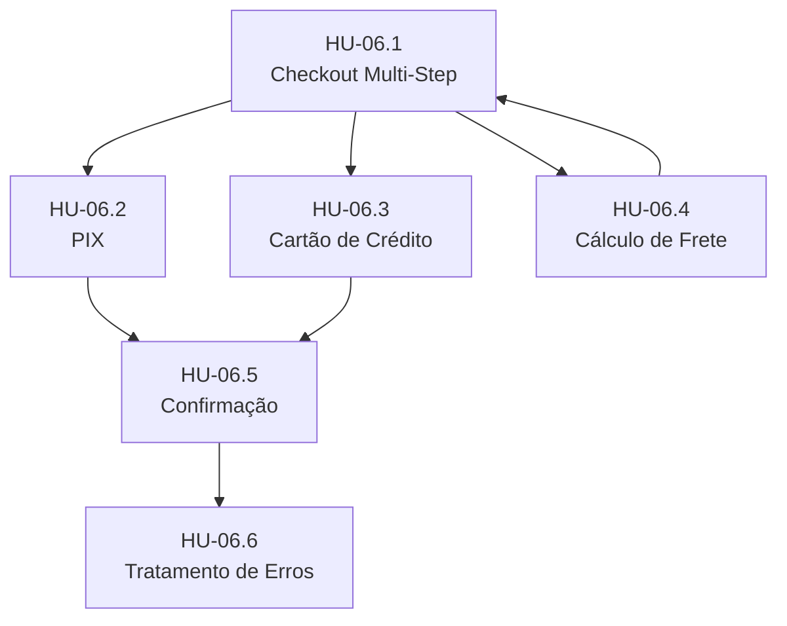

# REGALAYA - Épico 6: Checkout e Pagamento - Histórias Detalhadas

**Épico:** EP-06 - Checkout e Pagamento  
**Versão:** 1.0  
**Data:** 07 de abril de 2026  
**Status:** Pronto para Implementação  
**Conformidade:** PRD.md v1.0, CA.md v1.0, CU.md v1.0

---

## Visão Geral do Épico

**Descrição:** Processo completo de finalização de compra com múltiplas formas de pagamento (PIX, cartão de crédito), cálculo de frete automático e integração com gateways de pagamento.

**Objetivo de Negócio:**  
Converter carrinhos em pedidos pagos com taxa de conversão > 60% e taxa de abandono < 30%.

**Métricas de Sucesso:**
- Taxa de conversão checkout → pedido: > 60%
- Tempo médio para completar checkout: < 3 minutos
- Taxa de sucesso PIX: > 95%
- Taxa de sucesso cartão: > 98%
- Abandono no checkout: < 30%

**Dependências Críticas:**
- EP-05: Carrinho de Compras (backend completo)
- EP-15: Localização e Endereços (cadastro de endereços)
- EP-04: Catálogo de Produtos (produtos ativos)

---

## HU-06.1: Processo de Checkout Multi-Step

**Como** usuário autenticado,  
**Quero** finalizar minha compra em um processo de 3 passos com progresso visual claro,  
**Para** completar minha compra de forma rápida e sem confusão.

### Tarefas Técnicas

#### Backend (regalaya-api)
- [ ] **Criar tabela `orders`** conforme schema em CA.md (linhas 381-408)
- [ ] **Criar tabela `order_items`** conforme schema (linhas 421-436)
- [ ] **Criar OrderService** com método `createOrderFromCart(CreateOrderRequest)`
  - Validar estoque disponível de todos os produtos
  - Calcular subtotal, total, aplicar descontos
  - Criar order + order_items em transação atômica
  - Retornar OrderDetailResponse com ID e order_number
- [ ] **Implementar endpoint POST `/v1/client/orders`**
  - Auth requerido (USER/ADMIN)
  - Request: CreateOrderRequest (contactId, addressId, items[], message, scheduledAt, paymentMethod)
  - Response: 201 + OrderDetailResponse
  - Validações:
    - Carrinho não vazio
    - Todos produtos existem e estão ativos
    - Estoque suficiente
    - Contato existe e pertence ao usuário
    - Endereço válido (se fornecido)
- [ ] **Implementar endpoint GET `/v1/client/orders`** (paginação)
- [ ] **Implementar endpoint GET `/v1/client/orders/{id}`**
- [ ] **Criar OrderMapper** (MapStruct) para mapear Order ↔ OrderResponse/OrderDetailResponse
- [ ] **Implementar validação de estoque** em tempo real com otimismo (SELECT ... FOR UPDATE ou otimista com version)
- [ ] **Integrar com PaymentService** para criar payment intent durante checkout (não obrigatório ainda, mas estrutura)
- [ ] **Integrar com ShippingService** para cálculo de frete no ato da criação do pedido

#### Frontend (regalaya-web)
- [ ] **Criar página `/checkout`** com roteamento protegido (requires auth)
- [ ] **Implementar componente `CheckoutStepper`** visualizando 3 passos:
  - Step 1: 📦 Revisão do Carrinho
  - Step 2: 📍 Endereço de Entrega
  - Step 3: 💳 Pagamento
- [ ] **Step 1 - Revisão do Carrinho:**
  - Listar todos os itens do carrinho (com imagem, nome, preço, quantidade)
  - Mostrar subtotal
  - Botão "Continuar" → Step 2
  - Botão "Voltar ao carrinho"
- [ ] **Step 2 - Endereço de Entrega:**
  - Buscar endereços do usuário via `GET /v1/addresses`
  - Mostrar endereços em cards radio-select
  - Opção "Adicionar novo endereço" (abrir modal com formulário CU.md 2.2.2)
  - Mostrar cálculo de frete (callback após selecionar endereço, chamar `POST /v1/shipping/calculate`)
  - Mostrar opções de frete (PAC, SEDEX, etc) com preço e prazo
  - Botão "Continuar" → Step 3
  - Botão "Voltar"
- [ ] **Step 3 - Pagamento:**
  - Seletor de método: [PIX] [Cartão de Crédito]
  - Se PIX:
    - Mostrar QR Code (imagem) e código copiável
    - Countdown de expiração (ex: 10 minutos)
    - Informações: "Após o pagamento, o status será atualizado automaticamente"
    - Botão "Já paguei" (trigger manual de verificação)
  - Se Cartão:
    - Formulário: número, nome, validade, CVV (usar Stripe Elements ou similar)
    - Seletor de parcelas (1x a 12x) calcular juros
    - Botão "Pagar agora" (chamar `POST /v1/payments/create-intent` e confirmar)
  - Botão "Voltar"
- [ ] **Implementar estados de loading** em cada step (skeleton ou spinner)
- [ ] **Tratamento de erros:**
  - Estoque insuficiente: mostrar mensagem por item, remover do carrinho automaticamente
  - Erro de frete: mostrar mensagem "Não foi possível calcular frete, tente novamente"
  - Erro de criação de pedido: rollback e mostrar erro
- [ ] **Após sucesso:**
  - Mostrar página de confirmação com order_number, valor total, estimativa de entrega
  - Botão "Ver meus pedidos"
  - Disparar evento para limpar carrinho no backend (DELETE /v1/cart)
  - Opcional: agendar notificação WhatsApp de confirmação

#### Testes
- [ ] **Unit tests (backend):**
  - OrderService.createOrderFromCart() com estoque insuficiente → throws InsufficientStockException
  - OrderService.createOrderFromCart() com sucesso → pedido criado com status PENDING
  - OrderService.calculateTotals() com cupom aplicado
  - OrderService.transaction rollback em caso de falha
- [ ] **Integration tests (backend):**
  - POST `/v1/client/orders` com payload válido → 201 Created
  - POST `/v1/client/orders` com estoque insuficiente → 400
  - GET `/v1/client/orders` retorna apenas pedidos do usuário logado
- [ ] **E2E tests (frontend - Playwright/Cypress):**
  - Fluxo completo: carrinho → checkout step 1 → step 2 → step 3 → confirmação
  - Cancelar no step 2, voltar ao step 1
  - Adicionar novo endereço durante checkout
  - Selecionar PIX e ver QR Code

---

## HU-06.2: Integração PIX (Pagamento Instantâneo)

**Como** usuário,  
**Quero** pagar meu pedido via PIX com QR Code e desconto,  
**Para** ter agilidade e economia na compra.

### Tarefas Técnicas

#### Backend (regalaya-api)
- [ ] **Criar módulo `payment`** (conforme CA.md 4.1)
  - `domain.model.Payment` (linhas 521-537 do CA.md)
  - `PaymentRepository` (JPA)
  - `PaymentService` com interface `PaymentProvider`
- [ ] **Implementar provider `PixProvider`** (se for usar Stripe/MP ambos suportam PIX)
  - `createPixPayment(Order order)` → gera QR Code e qrCodeImage (base64)
  - Retorna: `{ pixId, qrCode, qrCodeImage, expirationAt, copyPasteCode }`
  - Salvar registro em `payments` table com status `pending`
- [ ] **Endpoint POST `/v1/payments/create-intent`**
  - Request: `{ orderId, paymentMethod: 'PIX' }`
  - Response: `{ provider, providerPaymentId, qrCode, qrCodeImage, expiresAt }`
  - Validar order pertence ao usuário e status é PENDING
  - Chamar provider e salvar payment record
  - Atualizar order.payment_method e order.payment_status = 'pending'
- [ ] **Endpoint GET `/v1/payments/{orderId}`** para polling
  - Retorna status atual do pagamento (pending/paid/failed)
- [ ] **Webhook `/v1/payments/webhook/stripe` e `/webhook/mercadopago`**
  - Verificar assinatura do provider
  - Processar eventos: `payment_intent.succeeded`, `payment_intent.payment_failed`
  - Atualizar `payments.status` e `orders.payment_status`
  - Se pago: order.status = 'PROCESSING', agendar shipping
  - Se falhou: order.status = 'PENDING' (ou manter, dependendo da regra)
  - Logar em `webhook_logs`
- [ ] **Job scheduler** para verificar pagamentos PIX expirados:
  - Query: payments WHERE status='pending' AND provider='PIX' AND created_at > 1h
  - Atualizar para 'expired', order.status volta para 'PENDING'
  - Notificar usuário por email/WhatsApp
- [ ] **Implementar retry com backoff exponencial** para falhas na API de pagamento
- [ ] **Circuit breaker** (Resilience4j) para API externa de pagamento

#### Frontend (regalaya-web)
- [ ] **No Step 3 (Pagamento), se PIX selecionado:**
  - Chamar `POST /v1/payments/create-intent` com orderId
  - Exibir QR Code (imagem) e código copiável
  - Countdown timer (ex: 10:00) contando regressivamente
  - Copiar código com um clique
  - Instruções: "Abra o app do seu banco e escaneie o QR Code"
- [ ] **Polling automático (a cada 5s)**
  - GET `/v1/payments/{orderId}` até status != 'pending'
  - Se status = 'paid': redirecionar para página de sucesso
  - Se status = 'failed': mostrar erro e permitir tentar outro método
  - Se expirado: mostrar mensagem "PIX expirado, escolha outra forma de pagamento"
- [ ] **Botão "Já paguei"** para polling manual
- [ ] **Página de sucesso PIX:**
  - ✅ "Pagamento confirmado!"
  - Detalhes: order_number, valor, estimativa de entrega
  - Botão "Ver meus pedidos"

#### Testes
- [ ] **Unit tests (backend):**
  - PixProvider.createPixPayment() gera QR Code único
  - PaymentService.handleWebhookSuccess() atualiza order status corretamente
  - PaymentService.retryFailedPayments() com circuit breaker
- [ ] **Integration tests:**
  - Fluxo completo PIX: create-intent → polling → webhook → order atualizado
  - PIX expirado: order volta para PENDING
  - Webhook com assinatura inválida → 403
- [ ] **E2E tests (frontend):**
  - Selecionar PIX, ver QR Code, esperar confirmação simulada
  - Simular PIX expirado, tentar novamente
  - Pagamento recusado, mudar para cartão

---

## HU-06.3: Integração Cartão de Crédito

**Como** usuário,  
**Quero** pagar com cartão de crédito com parcelamento,  
**Para** dividir o pagamento ou usar meu limite.

### Tarefas Técnicas

#### Backend (regalaya-api)
- [ ] **Implementar provider `CreditCardProvider`** (Stripe ou Mercado Pago)
  - `createCardPayment(Order order, CardDetails card)` → PaymentIntent
  - Suportar tokenização (não armazenar dados do cartão no nosso BD)
  - Retornar `clientSecret` para confirmação no frontend
  - Configurar webhook conforme HU-06.2
  - Implementar cálculo de parcelas (juros ou sem juros, conforme regra de negócio)
- [ ] **Endpoint POST `/v1/payments/create-intent`** (já existe, estender para CARD)
  - Request: `{ orderId, paymentMethod: 'CREDIT_CARD', cardToken? }`
  - Response: `{ clientSecret, paymentIntentId }`
  - Se cartão salvo do usuário (token), usar token
  - Caso contrário, frontend envia token gerado por Stripe Elements (nunca dados brutos)
- [ ] **Endpoint POST `/v1/payments/confirm`** (se for necessário confirmar após tokenização)
  - Client envia `paymentIntentId` + `clientSecret`
  - Backend chama `confirm()` no provider
- [ ] **Implementar lógica de parcelamento:**
  - Consultar configuração: `max_installments` (ex: at 12x)
  - Calcular valor da parcela: total / n (com ou sem juros)
  - Armazenar `installments` na tabela `payments`
- [ ] **Tratar 3D Secure** (SCA) se provider exigir:
  - Detectar que payment requer authentication
  - Retornar `requiresAction: true` + `clientSecret`
  - Frontend lida com challenge
- [ ] **Idempotency key** para evitar duplicação de cobranças:
  - Header `Idempotency-Key: {orderId}-{timestamp}`
  - Cachear resultado por 24h em Redis

#### Frontend (regalaya-web)
- [ ] **No Step 3 (Pagamento), se Cartão selecionado:**
  - Carregar Stripe.js (ou MP SDK) com publishable key
  - Campo de cartão com máscara e validação (formatado por Stripe Elements)
  - Seletor de parcelas (1x a 12x) com cálculo de juros
    - Ex: "1x de R$ 189,90 sem juros"
    - "2x de R$ 94,95 sem juros"
    - "3x de R$ 63,30 (total R$ 189,90)"
  - Checkbox "Salvar cartão para próximas compras" (se implementar)
- [ ] **Processamento de pagamento:**
  - Coletar dados do cartão via Stripe Elements → gerar `paymentMethodId` ou `token`
  - Chamar `POST /v1/payments/create-intent` com `paymentMethod: 'CREDIT_CARD'`
  - Receber `clientSecret`
  - Chamar `stripe.confirmCardPayment(clientSecret)` (frontend)
  - Se requires_action: exibir challenge (3D Secure) em modal
  - Se sucesso: redirecionar para página de sucesso
  - Se falha: mostrar erro específico (cartão recusado, saldo insuficiente, etc.)
- [ ] **Loading state** durante processamento: "Processando pagamento..." (spinner)
- [ ] **Validação de cartão em tempo real:**number, expiry, CVC format
- [ ] **Mensagens de erro amigáveis:**
  - "Cartão recusado pelo banco"
  - "Saldo insuficiente"
  - "Erro na comunicação com o gateway, tente novamente"

#### Testes
- [ ] **Unit tests (backend):**
  - CreditCardProvider.createCardPayment() chama Stripe API corretamente
  - PaymentService.calculateInstallments() retorna valores corretos
  - Webhook de cartão processado sucesso/falha
- [ ] **Integration tests:**
  - Usar Stripe test mode (test cards) para simular fluxo completo
  - Testar 3D Secure (stripe card 4000002500003155)
  - Testar cartão recusado (stripe card 4000000000000002)
  - Testar idempotency: mesma orderId, paymentMethod → não duplicar
- [ ] **E2E tests (frontend):**
  - Usar Stripe test card 4242 4242 4242 4242 para pagamento aprovado
  - Pagamento com 3D Secure (test card acima)
  - Pagamento recusado (4000 0000 0000 0002)

---

## HU-06.4: Cálculo Automático de Frete

**Como** sistema,  
**Quero** calcular o frete automaticamente com base no CEP de destino, peso e dimensões,  
**Para** mostrar opções de entrega ao usuário durante o checkout.

### Tarefas Técnicas

#### Backend (regalaya-api)
- [ ] **Criar módulo `shipping`** (conforme CA.md 4.1)
  - `ShippingProvider` interface com método `calculate(ShippingCalcRequest)`
  - `ShippingCalcRequest`: `{ zipCode, weight, dimensions: {length, width, height} }`
  - `ShippingCalcResponse`: `List<ShippingOption> { carrier, service, price, days, estimatedDelivery }`
- [ ] **Implementar provider `CorreiosProvider`**
  - Integrar com API Correios `calcPrecoPrazo` (ou Mock em dev)
  - Parâmetros: CEPorigem (config), CEPdestino, peso, dimensões, servicios (PAC, SEDEX)
  - Retornar preço e prazo para cada serviço
  - Tratar erros da API (timeout, inválido CEP)
- [ ] **Implementar provider `LoggiProvider`** (opcional para MVP)
  - Se Correios falhar ou para clientes premium
- [ ] **Endpoint POST `/v1/shipping/calculate`**
  - Auth requerido (USER/ADMIN)
  - Request: `{ addressId? (ou zipCode, number, complement), cartItems[] }`
  - Se addressId: buscar address, usar zipCode + número para dimensões approximated
  - Calcular peso total dos items do carrinho (product.stock.weight ou metadata)
  - Chamar CorreiosProvider.calculate()
  - Retornar lista de opções ordenadas por prazo/preço
- [ ] **Lógica de Frete Grátis** (PRD: mínimo R$ 299,90)
  - Se subtotal >= 299.90 → frete grátis (apenas PAC)
  - Configuração: `app.shipping.free-shipping-threshold: 299.90`
  - Implementar como decorator ou estratégia no ShippingService
- [ ] **Cache de resultados** (Redis, TTL 1 hora)
  - Cache key: `shipping:{zipCode}:{weight}:{dimensionsHash}`
  - Invalidar se produtos do carrinho mudarem
- [ ] **Validação de CEP** integrada (ver EP-15.3)
  - Integrar ViaCEP ou Correios `enderecoPorCep` para validar e preencher cidade/estado
  - Se CEP inválido: 400 com mensagem "CEP não encontrado"
- [ ] **Webhook Correios** (se disponível) para rastreamento (usar em EP-22)
- [ ] **Timeouts e circuit breaker** para API externa:
  - Timeout: 10s
  - Circuit breaker: 10 falhas → open 120s
  - Fallback: retornar taxa fixa R$ 29,90 (com aviso "frete estimado")

#### Frontend (regalaya-web)
- [ ] **No Step 2 (Endereço), após selecionar endereço:**
  - Disparar automaticamente `POST /v1/shipping/calculate` com CEP do endereço + itens do carrinho
  - Mostrar loading spinner "Calculando frete..."
  - Exibir opções de entrega como radio buttons:
    - [○] PAC - R$ 25,90 - 7-10 dias úteis
    - [○] SEDEX - R$ 45,90 - 2-3 dias úteis
    - [○] Frete Grátis (PAC) - 7-10 dias úteis (se subtotal >= 299.90)
  - Selecionar por default a mais barata (ou frete grátis se disponível)
  - Mostrar subtotal + frete = total
- [ ] **Se CEP incompleto ou inválido:**
  - Mostrar erro "Informe um CEP válido para calcular o frete"
  - Bloquear avanço para Step 3
- [ ] **Atualizar total em tempo real** quando usuário muda opção de frete
- [ ] **Mostrar estimativa de entrega** (data prevista = hoje + dias úteis)
- [ ] **Botão "Recalcular"** caso usuário mude quantidade no carrinho (mas carrinho não deve ser editável no checkout; redirecionar para carrinho)
- [ ] **Display fallback:** se API de frete falhar, mostrar "Frete: R$ 29,90 (valor provisório, será confirmado no pagamento)"

#### Testes
- [ ] **Unit tests (backend):**
  - CorreiosProvider.calculate() retorna opções corretas
  - ShippingService.freeShippingApplied() quando subtotal >= threshold
  - Cache hit/miss funciona
  - Circuit breaker abre após N falhas
- [ ] **Integration tests:**
  - Mock de API Correios (usistem MockWebServer) para simular respostas
  - Testar CEP válido/inválido
  - Testar frete grátis ativado/desativado
- [ ] **E2E tests (frontend):**
  - Selecionar endereço → frete calculado e exibido
  - Simular erro de API → mostrar fallback
  - Verificar que subtotal muda conforme frete selecionado

---

## HU-06.5: Confirmação e Finalização do Pedido

**Como** usuário,  
**Quero** ver uma tela de confirmação clara com os detalhes do meu pedido,  
**Para** ter certeza de que minha compra foi realizada com sucesso.

### Tarefas Técnicas

#### Backend (regalaya-api)
- [ ] **Após pagamento confirmado (webhook):**
  - Atualizar `orders.status = 'PROCESSING'` se pago
  - Registrar `order.completed_at = NOW()`
  - Criar registros em `payments` (se ainda não existirem)
  - Disparar eventos de domínio: `OrderPaidEvent`
- [ ] **Endpoint GET `/v1/client/orders/{id}/confirmation`** (ou usar o mesmo detail)
  - Retornar dados completos para tela de confirmação:
    - order_number
    - items (product_name, quantity, unit_price, total, image_url)
    - shipping_address formatado
    - subtotal, shipping, discount, total
    - payment_method, payment_status
    - estimated_delivery_date (calculado a partir do frete)
    - tracking_code (se já houver, caso制品 já tenha sido despachado automaticamente)
- [ ] **Service `OrderConfirmationService`:**
  - Formatar endereço completo em string única
  - Calcular estimated_delivery_date = createdAt + shipping_days
  - Gerar mensagem de agradecimento personalizada (opcional)
- [ ] **Disparar notificação WhatsApp** (via NotificationService) após confirmação:
  - Template: "🎉 Presente comprado! Pedido #{orderNumber} confirmado. Entrega prevista: {data}"
  - Salvar em `notification_queue`
- [ ] **Enviar email de confirmação** (se implementado):
  - Usar template HTML com detalhes do pedido
  - Enviar para customer_email

#### Frontend (regalaya-web)
- [ ] **Página `/checkout/success/{orderId}`**
  - Layout: ✅ Grande checkmark verde
  - Title: "Presente comprado com sucesso!"
  - Conteúdo:
    - Número do pedido: #ORD123456
    - Data da compra: 07/04/2026
    - Itens comprados (lista com thumbnail, nome, qtd, preço)
    - Total: R$ 299,90
    - Endereço de entrega: formatted address
    - Método de pagamento: PIX / Cartão **** 1234
    - Estimativa de entrega: 15 a 20 de abril
    - Código de rastreio: (se já houver)
  - Botões:
    - [Ver meus pedidos] → /orders/{orderId}
    - [Continuar comprando] → /
- [ ] **Se PIX pendente (não confirmado ainda):**
  - Mostrar: "Aguardando confirmação do pagamento"
  - Exibir QR Code novamente (caso usuário precise pagar)
  - "Já pagou? Clique aqui para verificar status"
- [ ] **Se pagamento falhou:**
  - Mostrar: "Infelizmente, seu pagamento não foi aprovado"
  - Motivo: "Cartão recusado" ou "PIX expirado"
  - Botão: "Tentar novamente" → redireciona para Step 3 (Pagamento)
- [ ] **Compartilhar confirmação:**
  - Botão "Copiar número do pedido"
  - Opcional: botão "Enviar por WhatsApp" (gera mensagem pré-preenchida)

#### Testes
- [ ] **Unit tests:**
  - OrderConfirmationService.formatAddress() formata corretamente
  - Webhook payment_succeeded dispara OrderPaidEvent
  - NotificationService envia mensagem WhatsApp de confirmação
- [ ] **Integration tests:**
  - Fluxo completo: order + payment confirmed → status PROCESSING → notification_queue criada
- [ ] **E2E tests (frontend):**
  - Finalizar PIX com sucesso → tela de confirmação
  - Finalizar cartão com sucesso → tela de confirmação
  - Pagamento falha → mostra erro e permite retry

---

## HU-06.6: Tratamento de Erros e Edge Cases

**Como** sistema,  
**Quero** lidar robustamente com erros e situações excepcionais durante o checkout,  
**Para** não perder vendas e dar feedback claro ao usuário.

### Tarefas Técnicas

#### Backend
- [ ] **Rollback atômico:** criar order + order_items em transação única
  - Se qualquer item falhar (estoque), rollback completo
  - Não criar orders pendentes com estoque reservado se pagamento falhar
- [ ] **Deadlock avoidance:** usar otimista locking (version column) ou SELECT ... FOR UPDATE com timeout curto
- [ ] **Rate limiting** no endpoint de criação de pedido (30 req/min por usuário) para evitar spam
- [ ] **Validações robustas:**
  - Carrinho vazio → 400 "Seu carrinho está vazio"
  - Produto inexistente → 404 "Produto não encontrado"
  - Produto desativado → 400 "Produto indisponível"
  - Estoque insuficiente → 400 com lista de items problemáticos
  - Contato inexistente ou não pertence ao usuário → 404/403
  - Endereço inválido → 400
- [ ] **Logging estruturado** (JSON) de erros:
  - order_creation_failed com contexto: userId, cartItems count, error
- [ ] **Circuit breaker** para payment provider e shipping provider
- [ ] **Retry automático** para falhas transient:
  - Erro de conexão com Redis/DB: retry 3x com backoff
  - Payment provider timeout: retry 2x
- [ ] **Dead letter queue** para webhooks que falham consistentemente (log em webhook_logs.status=failed)

#### Frontend
- [ ] **Error boundaries** em páginas de checkout
- [ ] **Toasts/notificações** claras:
  - Sucesso: ✅ verde
  - Erro: ❌ vermelho com mensagem específica
  - Loading: ⏳ spinner
- [ ] **Retry automático** para falhas de rede (axios interceptors):
  - 429 (rate limit) → exponential backoff
  - 5xx → retry 2x
  - 4xx (exceto 401/403) → mostrar erro, não retry
- [ ] **Persistência de dados de checkout:**
  - Se usuário sair no meio, manter dados no sessionStorage
  - Ao voltar, repopular Step em que estava
- [ ] **Validar carrinho antes de iniciar checkout:**
  - Se carrinho vazio → redirecionar para home com toast "Seu carrinho está vazio"
  - Se produto desativado/estoque zerado → remover do carrinho automaticamente e notificar
- [ ] **Offline handling:**
  - Se sem conexão, mostrar banner "Sem conexão. Algumas operações podem falhar."
  - Desabilitar botão "Finalizar" se offline
- [ ] **Session expiry:**
  - Se JWT expira durante checkout → redirecionar para login, manter carrinho

#### Testes
- [ ] **Error scenario tests (backend):**
  - Criar order com estoque insuficiente → 400 com detalhes
  - Criar order com cartão expirado → payment_failed
  - Simular timeout do Correios → fallback aplicado
- [ ] **Frontend error state tests:**
  - Simular 500 no Step 2 → mostrar erro e botão "Tentar novamente"
  - Simular loss of connectivity → banner offline

---

## Dependências entre Histórias

**Ordem sugerida de implementação:**
1. HU-06.1 (Checkout Multi-Step) - Core
2. HU-06.4 (Cálculo de Frete) - integração com Step 2
3. HU-06.2 (PIX) - método preferido por usuários BR
4. HU-06.3 (Cartão de Crédito) - método alternativo
5. HU-06.5 (Confirmação) - após qualquer método funcionar
6. HU-06.6 (Erros) - refinamento contínuo

---

## Critérios de Aceitação Transversais

### Performance
- API de criação de pedido deve responder < 2s (p95)
- Tela de checkout carrega < 1.5s (LCP)
- Polling PIX não deve sobrecarregar API (max 1 req/5s)

### Segurança
- Nunca armazenar dados brutos de cartão (PCI DSS compliance)
- Validar ownership de carrinho, contato, endereço na criação do pedido
- Rate limiting em criação de pedidos (30/min)
- Logs sensíveis mascarados (email, phone)

### Monitoramento
- Métrica: `checkout.step.conversion` (percent que avança de step)
- Métrica: `orders.created` (contador)
- Métrica: `payment.success.rate` (PIX vs Cartão)
- Alerta: taxa de falha em criação de pedido > 5%

### QA Checklist
- [ ] Testado com produtos sem estoque
- [ ] Testado com carrinho vazio
- [ ] Testado com endereço inválido
- [ ] Testado com CEP inexistente
- [ ] Testado pagamento PIX expirado
- [ ] Testado cartão recusado
- [ ] Testado 3D Secure
- [ ] Testado offline no mobile
- [ ] Testado comportamento com múltiplas abas abertas
- [ ] Testado session expiry no meio do checkout

---

## Remove-MOCK Checklist

### Frontend (regalaya-web)
- [ ] `src/lib/mock-data.ts` → não deve conter `orders`, `checkout` mocks
- [ ] `src/services/checkout.service.ts` deve usar API real:
  - `createOrder()` → POST `/v1/client/orders`
  - `getPaymentStatus()` → GET `/v1/payments/{orderId}`
  - `calculateShipping()` → POST `/v1/shipping/calculate`
- [ ] `src/components/checkout/` sem dados hardcoded
- [ ] Loading states implementados (spinners/skeletons)
- [ ] Error handling com UI adequada

### Backend (regalaya-api)
- [ ] OrderServiceImpl sem uso de dados mockados
- [ ] PaymentService com implementação real (Stripe/MP)
- [ ] ShippingService com integração real (Correios)
- [ ] Todos os endpoints testados com dados reais (não fixtures fixas)
- [ ] Transaction management funcionando (rollback em falha)

---

## Estimativas

| História | Story Points | Dia(s) | Observações |
|----------|--------------|--------|-------------|
| HU-06.1 | 8 | 4 | Core do checkout, integrar carrinho + endereço |
| HU-06.2 | 5 | 3 | PIX provider (Stripe/MP) |
| HU-06.3 | 5 | 3 | Cartão provider (Stripe/MP) + 3DS |
| HU-06.4 | 5 | 3 | Correios API + cache + fallback |
| HU-06.5 | 3 | 2 | Telas de confirmação + notificações |
| HU-06.6 | 3 | 2 | Erros e edge cases |
| **Total** | **29** | **17** | ~3 sprints (2 semanas cada) |

**Nota:** Estimativas assumem equipe de 2-3 desenvolvedores full-stack, com backend e frontend trabalhando em paralelo.

---

## Riscos e Mitigações

| Risco | Impacto | Probabilidade | Mitigação |
|------|---------|---------------|-----------|
| Stripe/MP API instável | Alto | Média | Circuit breaker + fallback messaging |
| Correios API lenta/timeout | Médio | Alta | Cache + fallback rate fixa |
| 3D Secure增加 checkout friction | Alto | Média | UX otimizada, mensagens claras |
| Estoque inconsistente entre carrinho e pedido | Alto | Baixa | SELECT FOR UPDATE + atomic transaction |
| PIX expira antes do pagamento | Médio | Alta | Polling + mensagem clara de prazo |
| PCI DSS compliance (cartão) | Crítico | Baixa | Stripe Elements (tokenização) |

---

## Referências

- PRD.md: `docs/PRD.md` (especialmente seções MH-17, MH-11, MH-12)
- Architecture: `_bmad-output/planning-artifacts/CA.md` (seções 2, 3.12, 4.1, 6.3)
- UX Guidelines: `_bmad-output/planning-artifacts/CU.md` (seção 2.2.3, 4.2)
- Database Schema: CA.md linhas 381-537 (orders, order_items, payments, shipping_events)
- API Routes: CA.md seção 3.6-3.13 (Order, Payment, Shipping endpoints)

---

**Próximos Passos:**
1. Aprovação desta especificação
2. Sprint Planning: dividir tarefas em sub-tarefas menores (task breakdown)
3. Implementação backend (Order, Payment, Shipping modules)
4. Implementação frontend (Checkout UI)
5. Testes E2E completos
6. Deploy em staging para validação com usuários reais
7. Monitoramento de métricas pós-launch

---

**Responsáveis:**
- **Tech Lead (Backend):** OrderService, PaymentService, ShippingService
- **Tech Lead (Frontend):** Checkout pages, payment UI
- **DevOps:** Stripe/MP setup, Correios credentials, environment variables
- **QA:** E2E tests, performance testing

**Data prevista de conclusão:** 17 dias úteis (aproximadamente 3 sprints de 1 semana)
