# Regalaya - CA (Architecture Document)

**Versão:** 1.0  
**Data:** 07 de abril de 2026  
**Status:** Pronto para desenvolvimento  
**Baseado em:** `docs/PRD.md`, `_bmad-output/planning-artifacts/CU.md`

---

## 1. System Architecture Overview

### 1.1 Architecture Style: Clean Architecture

Regalaya follows Clean Architecture (Uncle Bob) with four concentric layers. Dependencies flow inward — outer layers depend on inner layers, never the reverse.

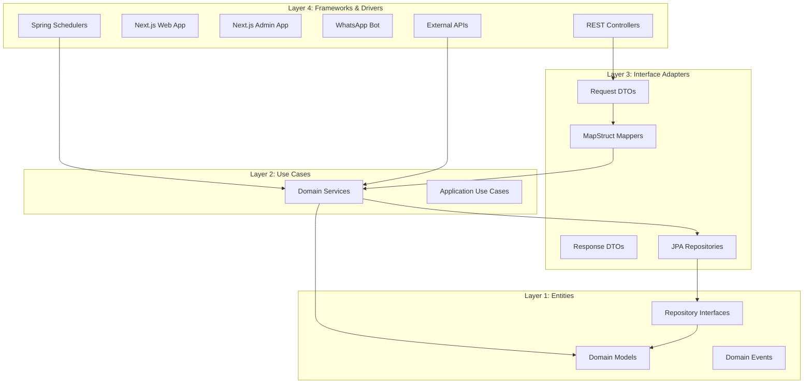

### 1.2 Component Diagram

```mermaid
graph TB
    subgraph "Client Tier"
        WEB[regalaya.com.br<br/>Next.js 16 + React 19]
        ADMIN[admin.regalaya.com.br<br/>Next.js 16 + React 19]
        WHATSAPP[WhatsApp Cloud API]
    end

    subgraph "API Gateway / Load Balancer"
        LB[AWS ALB / CloudFront]
    end

    subgraph "Application Tier - Spring Boot 3.4"
        subgraph "Auth Module"
            AUTH_CTRL[AuthController]
            AUTH_SVC[AuthService]
            JWT[JwtUtil + JwtFilter]
            SEC[SecurityConfig]
        end

        subgraph "Contact Module"
            CONTACT_CTRL[ContactController]
            CONTACT_SVC[ContactService]
        end

        subgraph "Product Module"
            PROD_CTRL[ProductController]
            PROD_SVC[ProductService]
            CAT_CTRL[CategoryController]
        end

        subgraph "Order Module"
            ORDER_CTRL[OrderController]
            CLIENT_ORDER[ClientOrderController]
            ORDER_SVC[OrderService]
        end

        subgraph "Cart Module"
            CART_CTRL[CartController]
            CART_SVC[CartService]
        end

        subgraph "Address Module"
            ADDR_CTRL[AddressController]
            ADDR_SVC[AddressService]
        end

        subgraph "Dashboard Module"
            DASH_CTRL[DashboardController]
            DASH_SVC[DashboardService]
        end

        subgraph "To Be Implemented"
            WA_CTRL[WhatsAppController]
            WA_SVC[WhatsAppService]
            AI_CTRL[AIController]
            AI_SVC[AIService]
            PAY_CTRL[PaymentController]
            PAY_SVC[PaymentService]
            SHIP_CTRL[ShippingController]
            SHIP_SVC[ShippingService]
            NOTIF_SCHED[NotificationScheduler]
        end
    end

    subgraph "Data Tier"
        PG[(PostgreSQL 15+<br/>+ pgvector)]
        REDIS[(Redis 7+<br/>Cache + Cart)]
        S3[(AWS S3 / LocalStack<br/>Image Storage)]
    end

    subgraph "External Services"
        WA_API[WhatsApp Cloud API]
        OPENAI[OpenAI GPT-4<br/>Ada-002 Embeddings]
        STRIPE[Stripe / Mercado Pago]
        CORREIOS[Correios API]
    end

    WEB --> LB
    ADMIN --> LB
    WHATSAPP --> WA_CTRL

    LB --> AUTH_CTRL
    LB --> CONTACT_CTRL
    LB --> PROD_CTRL
    LB --> ORDER_CTRL
    LB --> CLIENT_ORDER
    LB --> CART_CTRL
    LB --> ADDR_CTRL
    LB --> DASH_CTRL

    AUTH_CTRL --> AUTH_SVC
    AUTH_SVC --> JWT
    AUTH_SVC --> SEC
    CONTACT_CTRL --> CONTACT_SVC
    PROD_CTRL --> PROD_SVC
    ORDER_CTRL --> ORDER_SVC
    CLIENT_ORDER --> ORDER_SVC
    CART_CTRL --> CART_SVC
    ADDR_CTRL --> ADDR_SVC
    DASH_CTRL --> DASH_SVC

    WA_CTRL --> WA_SVC
    AI_CTRL --> AI_SVC
    PAY_CTRL --> PAY_SVC
    SHIP_CTRL --> SHIP_SVC

    AUTH_SVC --> PG
    CONTACT_SVC --> PG
    PROD_SVC --> PG
    ORDER_SVC --> PG
    CART_SVC --> REDIS
    ADDR_SVC --> PG
    DASH_SVC --> PG

    AI_SVC --> OPENAI
    PAY_SVC --> STRIPE
    SHIP_SVC --> CORREIOS
    WA_SVC --> WA_API

    NOTIF_SCHED --> WA_API
    NOTIF_SCHED --> PG
```

### 1.3 Technology Stack Summary

| Layer | Technology | Version |
|-------|-----------|---------|
| **Frontend Web** | Next.js (App Router) | 16 |
| **Frontend UI** | React + TypeScript | 19 |
| **Frontend Styling** | Tailwind CSS + shadcn/ui | Latest |
| **Frontend State** | Zustand | Latest |
| **Backend Framework** | Spring Boot | 3.4.0 |
| **Backend Language** | Java | 21 |
| **Security** | Spring Security + JWT (jjwt) | 0.11.5 |
| **ORM** | Spring Data JPA + Hibernate | Latest |
| **DTO Mapping** | MapStruct | 1.6.2 |
| **API Docs** | Springdoc OpenAPI | 2.8.6 |
| **Rate Limiting** | Bucket4j | 8.1.0 |
| **Database** | PostgreSQL + pgvector | 15+ |
| **Cache** | Redis | 7+ |
| **Object Storage** | AWS S3 (LocalStack dev) | SDK 2.25.16 |
| **Email** | Spring Mail + Mailpit (dev) | Latest |
| **AI/LLM** | OpenAI GPT-4 + Ada-002 | Latest |
| **Payments** | Stripe / Mercado Pago | TBD |
| **Shipping** | Correios API | TBD |
| **WhatsApp** | WhatsApp Cloud API | Latest |

---

## 2. Complete Database Schema

### 2.1 Schema Overview (DDL)

```sql
-- ===================================================================
-- REGALAYA DATABASE SCHEMA - PostgreSQL 15+ with pgvector
-- ===================================================================

-- Enable pgvector extension for AI embeddings
CREATE EXTENSION IF NOT EXISTS vector;

-- ===================================================================
-- 1. USERS TABLE
-- ===================================================================
CREATE TABLE users (
    id                  UUID PRIMARY KEY DEFAULT gen_random_uuid(),
    name                VARCHAR(100) NOT NULL,
    phone               VARCHAR(20),
    email               VARCHAR(150) NOT NULL UNIQUE,
    password            VARCHAR(255) NOT NULL,
    role                VARCHAR(20) NOT NULL DEFAULT 'USER' CHECK (role IN ('ADMIN', 'USER', 'CLIENT')),
    plan                VARCHAR(20) NOT NULL DEFAULT 'FREE' CHECK (plan IN ('FREE', 'PREMIUM', 'BUSINESS')),
    status              VARCHAR(50) NOT NULL DEFAULT 'ACTIVE',
    email_verified      BOOLEAN DEFAULT FALSE,
    verification_token  VARCHAR(255),
    reset_password_token VARCHAR(255),
    reset_password_expires_at TIMESTAMP,
    last_login_at       TIMESTAMP,
    deleted_at          TIMESTAMP,
    created_at          TIMESTAMP NOT NULL DEFAULT NOW(),
    updated_at          TIMESTAMP NOT NULL DEFAULT NOW()
);

CREATE INDEX idx_users_email ON users(email);
CREATE INDEX idx_users_phone ON users(phone);
CREATE INDEX idx_users_status ON users(status);
CREATE INDEX idx_users_role ON users(role);
CREATE INDEX idx_users_deleted_at ON users(deleted_at) WHERE deleted_at IS NOT NULL;

-- ===================================================================
-- 2. CONTACTS TABLE (Pessoas Queridas)
-- ===================================================================
CREATE TABLE contacts (
    id                  UUID PRIMARY KEY DEFAULT gen_random_uuid(),
    user_id             UUID NOT NULL REFERENCES users(id) ON DELETE CASCADE,
    name                VARCHAR(200) NOT NULL,
    phone               VARCHAR(20),
    whatsapp_id         VARCHAR(100),
    consent             BOOLEAN DEFAULT FALSE,
    created_at          TIMESTAMP NOT NULL DEFAULT NOW(),
    updated_at          TIMESTAMP NOT NULL DEFAULT NOW()
);

CREATE INDEX idx_contacts_user_id ON contacts(user_id);
CREATE INDEX idx_contacts_phone ON contacts(phone);
CREATE INDEX idx_contacts_whatsapp_id ON contacts(whatsapp_id);

-- ===================================================================
-- 3. SPECIAL_DATES TABLE (Datas Especiais)
-- ===================================================================
CREATE TABLE special_dates (
    id                  UUID PRIMARY KEY DEFAULT gen_random_uuid(),
    contact_id          UUID NOT NULL REFERENCES contacts(id) ON DELETE CASCADE,
    type                VARCHAR(30) NOT NULL CHECK (type IN ('BIRTHDAY', 'ANNIVERSARY', 'CHRISTMAS', 'WEDDING', 'MOTHERS_DAY', 'FATHERS_DAY', 'VALENTINES_DAY', 'CUSTOM')),
    date                DATE NOT NULL,
    recurrence          VARCHAR(20) CHECK (recurrence IN ('YEARLY', 'MONTHLY', 'ONCE')),
    last_notified       DATE,
    created_at          TIMESTAMP NOT NULL DEFAULT NOW(),
    updated_at          TIMESTAMP NOT NULL DEFAULT NOW()
);

CREATE INDEX idx_special_dates_contact_id ON special_dates(contact_id);
CREATE INDEX idx_special_dates_date ON special_dates(date);
CREATE INDEX idx_special_dates_type ON special_dates(type);
CREATE INDEX idx_special_dates_last_notified ON special_dates(last_notified);
-- Composite index for notification scheduler
CREATE INDEX idx_special_dates_upcoming ON special_dates(date, type, last_notified)
    WHERE recurrence = 'YEARLY';

-- ===================================================================
-- 4. ADDRESSES TABLE
-- ===================================================================
CREATE TABLE addresses (
    id                  UUID PRIMARY KEY DEFAULT gen_random_uuid(),
    user_id             UUID NOT NULL REFERENCES users(id) ON DELETE CASCADE,
    label               VARCHAR(200) NOT NULL,
    zip_code            VARCHAR(9) NOT NULL,
    street              VARCHAR(200) NOT NULL,
    number              VARCHAR(20) NOT NULL,
    complement          VARCHAR(100),
    neighborhood        VARCHAR(100) NOT NULL,
    city                VARCHAR(100) NOT NULL,
    state               VARCHAR(2) NOT NULL,
    reference           VARCHAR(50),
    recipient_phone     VARCHAR(20),
    is_default          BOOLEAN NOT NULL DEFAULT FALSE,
    is_active           BOOLEAN NOT NULL DEFAULT TRUE,
    created_at          TIMESTAMP NOT NULL DEFAULT NOW(),
    updated_at          TIMESTAMP NOT NULL DEFAULT NOW()
);

CREATE INDEX idx_addresses_user_id ON addresses(user_id);
CREATE INDEX idx_addresses_zip_code ON addresses(zip_code);
CREATE INDEX idx_addresses_user_default ON addresses(user_id, is_default) WHERE is_default = TRUE;

-- ===================================================================
-- 5. CATEGORIES TABLE (Hierarchical)
-- ===================================================================
CREATE TABLE categories (
    id                  UUID PRIMARY KEY DEFAULT gen_random_uuid(),
    name                VARCHAR(100) NOT NULL,
    slug                VARCHAR(120) NOT NULL UNIQUE,
    description         VARCHAR(500),
    image_url           VARCHAR(500),
    parent_id           UUID REFERENCES categories(id) ON DELETE SET NULL,
    sort_order          INTEGER NOT NULL DEFAULT 0,
    is_active           BOOLEAN NOT NULL DEFAULT TRUE,
    created_at          TIMESTAMP NOT NULL DEFAULT NOW(),
    updated_at          TIMESTAMP NOT NULL DEFAULT NOW()
);

CREATE INDEX idx_categories_slug ON categories(slug);
CREATE INDEX idx_categories_parent ON categories(parent_id);
CREATE INDEX idx_categories_active ON categories(is_active);

-- ===================================================================
-- 6. PRODUCTS TABLE
-- ===================================================================
CREATE TABLE products (
    id                  UUID PRIMARY KEY DEFAULT gen_random_uuid(),
    name                VARCHAR(200) NOT NULL,
    slug                VARCHAR(220) NOT NULL UNIQUE,
    description         VARCHAR(5000),
    short_description   VARCHAR(500),
    price               NUMERIC(10,2) NOT NULL,
    compare_at_price    NUMERIC(10,2),
    sku                 VARCHAR(50) UNIQUE,
    stock               INTEGER NOT NULL DEFAULT 0,
    is_active           BOOLEAN NOT NULL DEFAULT TRUE,
    images              VARCHAR(2000),
    category_id         UUID REFERENCES categories(id) ON DELETE SET NULL,
    created_at          TIMESTAMP NOT NULL DEFAULT NOW(),
    updated_at          TIMESTAMP NOT NULL DEFAULT NOW()
);

CREATE INDEX idx_products_slug ON products(slug);
CREATE INDEX idx_products_sku ON products(sku);
CREATE INDEX idx_products_category ON products(category_id);
CREATE INDEX idx_products_active ON products(is_active);
CREATE INDEX idx_products_price ON products(price);
CREATE INDEX idx_products_stock ON products(stock);
-- Full-text search index
CREATE INDEX idx_products_search ON products USING gin(to_tsvector('portuguese', name || ' ' || COALESCE(description, '')));

-- ===================================================================
-- 7. PRODUCT_EMBEDDINGS TABLE (pgvector for AI RAG)
-- ===================================================================
CREATE TABLE product_embeddings (
    id                  UUID PRIMARY KEY DEFAULT gen_random_uuid(),
    product_id          UUID NOT NULL REFERENCES products(id) ON DELETE CASCADE,
    embedding           vector(1536),
    metadata            JSONB,
    created_at          TIMESTAMP NOT NULL DEFAULT NOW()
);

CREATE INDEX idx_product_embeddings_product ON product_embeddings(product_id);
-- HNSW index for vector similarity search
CREATE INDEX idx_product_embeddings_vector ON product_embeddings
    USING hnsw (embedding vector_cosine_ops);

-- ===================================================================
-- 8. ORDERS TABLE
-- ===================================================================
CREATE TABLE orders (
    id                  UUID PRIMARY KEY DEFAULT gen_random_uuid(),
    user_id             UUID REFERENCES users(id) ON DELETE SET NULL,
    contact_id          UUID REFERENCES contacts(id) ON DELETE SET NULL,
    order_number        VARCHAR(20) NOT NULL UNIQUE,
    customer_name       VARCHAR(100) NOT NULL,
    customer_email      VARCHAR(150) NOT NULL,
    customer_phone      VARCHAR(20),
    status              VARCHAR(20) NOT NULL DEFAULT 'PENDING'
        CHECK (status IN ('PENDING', 'PROCESSING', 'SHIPPED', 'DELIVERED', 'CANCELLED', 'REFUNDED')),
    total               NUMERIC(10,2) NOT NULL,
    subtotal            NUMERIC(10,2) NOT NULL,
    shipping            NUMERIC(10,2) NOT NULL DEFAULT 0,
    discount            NUMERIC(10,2) NOT NULL DEFAULT 0,
    payment_method      VARCHAR(30),
    payment_status      VARCHAR(20) DEFAULT 'pending'
        CHECK (payment_status IN ('pending', 'paid', 'failed', 'refunded', 'partially_refunded')),
    payment_intent_id   VARCHAR(255),
    shipping_address    VARCHAR(1000),
    notes               VARCHAR(1000),
    tracking_code       VARCHAR(50),
    message             TEXT,
    scheduled_at        TIMESTAMP,
    completed_at        TIMESTAMP,
    created_at          TIMESTAMP NOT NULL DEFAULT NOW(),
    updated_at          TIMESTAMP NOT NULL DEFAULT NOW()
);

CREATE INDEX idx_orders_user_id ON orders(user_id);
CREATE INDEX idx_orders_contact_id ON orders(contact_id);
CREATE INDEX idx_orders_order_number ON orders(order_number);
CREATE INDEX idx_orders_status ON orders(status);
CREATE INDEX idx_orders_payment_status ON orders(payment_status);
CREATE INDEX idx_orders_created_at ON orders(created_at DESC);
CREATE INDEX idx_orders_scheduled_at ON orders(scheduled_at) WHERE scheduled_at IS NOT NULL;
CREATE INDEX idx_orders_user_created ON orders(user_id, created_at DESC);

-- ===================================================================
-- 9. ORDER_ITEMS TABLE
-- ===================================================================
CREATE TABLE order_items (
    id                  UUID PRIMARY KEY DEFAULT gen_random_uuid(),
    order_id            UUID NOT NULL REFERENCES orders(id) ON DELETE CASCADE,
    product_name        VARCHAR(200) NOT NULL,
    product_sku         VARCHAR(50),
    quantity            INTEGER NOT NULL,
    unit_price          NUMERIC(10,2) NOT NULL,
    total               NUMERIC(10,2) NOT NULL,
    image_url           VARCHAR(500),
    created_at          TIMESTAMP NOT NULL DEFAULT NOW(),
    updated_at          TIMESTAMP NOT NULL DEFAULT NOW()
);

CREATE INDEX idx_order_items_order_id ON order_items(order_id);
CREATE INDEX idx_order_items_sku ON order_items(product_sku);

-- ===================================================================
-- 10. CART ITEMS TABLE (Redis-backed, but DB table for persistence)
-- ===================================================================
CREATE TABLE cart_items (
    id                  UUID PRIMARY KEY DEFAULT gen_random_uuid(),
    user_id             UUID NOT NULL REFERENCES users(id) ON DELETE CASCADE,
    product_id          UUID NOT NULL REFERENCES products(id) ON DELETE CASCADE,
    quantity            INTEGER NOT NULL DEFAULT 1,
    created_at          TIMESTAMP NOT NULL DEFAULT NOW(),
    updated_at          TIMESTAMP NOT NULL DEFAULT NOW(),
    UNIQUE(user_id, product_id)
);

CREATE INDEX idx_cart_items_user_id ON cart_items(user_id);

-- ===================================================================
-- 11. GIFT_HISTORY TABLE
-- ===================================================================
CREATE TABLE gift_history (
    id                  UUID PRIMARY KEY DEFAULT gen_random_uuid(),
    order_id            UUID NOT NULL REFERENCES orders(id) ON DELETE CASCADE,
    message             TEXT,
    whatsapp_sent       BOOLEAN DEFAULT FALSE,
    whatsapp_sent_at    TIMESTAMP,
    delivered_at        TIMESTAMP,
    rating              INTEGER CHECK (rating >= 1 AND rating <= 5),
    feedback            TEXT,
    created_at          TIMESTAMP NOT NULL DEFAULT NOW()
);

CREATE INDEX idx_gift_history_order_id ON gift_history(order_id);
CREATE INDEX idx_gift_history_rating ON gift_history(rating);
CREATE INDEX idx_gift_history_delivered ON gift_history(delivered_at);

-- ===================================================================
-- 12. NOTIFICATION_QUEUE TABLE (Scheduled messages)
-- ===================================================================
CREATE TABLE notification_queue (
    id                  UUID PRIMARY KEY DEFAULT gen_random_uuid(),
    user_id             UUID NOT NULL REFERENCES users(id) ON DELETE CASCADE,
    contact_id          UUID REFERENCES contacts(id) ON DELETE SET NULL,
    special_date_id     UUID REFERENCES special_dates(id) ON DELETE SET NULL,
    type                VARCHAR(30) NOT NULL CHECK (type IN ('DATE_REMINDER_7D', 'DATE_REMINDER_1D', 'ORDER_CONFIRMATION', 'ORDER_SHIPPED', 'ORDER_DELIVERED', 'AI_RECOMMENDATION', 'MARKETING')),
    recipient_phone     VARCHAR(20) NOT NULL,
    message_template    TEXT NOT NULL,
    message_data        JSONB,
    scheduled_at        TIMESTAMP NOT NULL,
    sent_at             TIMESTAMP,
    status              VARCHAR(20) NOT NULL DEFAULT 'PENDING'
        CHECK (status IN ('PENDING', 'SENT', 'FAILED', 'CANCELLED')),
    retry_count         INTEGER NOT NULL DEFAULT 0,
    max_retries         INTEGER NOT NULL DEFAULT 3,
    error_message       TEXT,
    created_at          TIMESTAMP NOT NULL DEFAULT NOW(),
    updated_at          TIMESTAMP NOT NULL DEFAULT NOW()
);

CREATE INDEX idx_notification_queue_status ON notification_queue(status);
CREATE INDEX idx_notification_queue_scheduled ON notification_queue(scheduled_at, status)
    WHERE status = 'PENDING';
CREATE INDEX idx_notification_queue_user ON notification_queue(user_id);
CREATE INDEX idx_notification_queue_type ON notification_queue(type);

-- ===================================================================
-- 13. WHATSAPP_SESSIONS TABLE
-- ===================================================================
CREATE TABLE whatsapp_sessions (
    id                  UUID PRIMARY KEY DEFAULT gen_random_uuid(),
    phone_number        VARCHAR(20) NOT NULL UNIQUE,
    user_id             UUID REFERENCES users(id) ON DELETE SET NULL,
    state               VARCHAR(50) NOT NULL DEFAULT 'NEW',
    context_data        JSONB,
    last_message_at     TIMESTAMP,
    created_at          TIMESTAMP NOT NULL DEFAULT NOW(),
    updated_at          TIMESTAMP NOT NULL DEFAULT NOW()
);

CREATE INDEX idx_whatsapp_sessions_phone ON whatsapp_sessions(phone_number);
CREATE INDEX idx_whatsapp_sessions_user ON whatsapp_sessions(user_id);
CREATE INDEX idx_whatsapp_sessions_state ON whatsapp_sessions(state);

-- ===================================================================
-- 14. PAYMENTS TABLE
-- ===================================================================
CREATE TABLE payments (
    id                  UUID PRIMARY KEY DEFAULT gen_random_uuid(),
    order_id            UUID NOT NULL REFERENCES orders(id) ON DELETE CASCADE,
    provider            VARCHAR(30) NOT NULL CHECK (provider IN ('STRIPE', 'MERCADO_PAGO', 'PIX')),
    provider_payment_id VARCHAR(255) NOT NULL UNIQUE,
    amount              NUMERIC(10,2) NOT NULL,
    currency            VARCHAR(3) NOT NULL DEFAULT 'BRL',
    status              VARCHAR(20) NOT NULL DEFAULT 'pending'
        CHECK (status IN ('pending', 'authorized', 'captured', 'failed', 'refunded', 'expired')),
    payment_method_type VARCHAR(30),
    metadata            JSONB,
    paid_at             TIMESTAMP,
    refunded_at         TIMESTAMP,
    created_at          TIMESTAMP NOT NULL DEFAULT NOW(),
    updated_at          TIMESTAMP NOT NULL DEFAULT NOW()
);

CREATE INDEX idx_payments_order_id ON payments(order_id);
CREATE INDEX idx_payments_provider_id ON payments(provider_payment_id);
CREATE INDEX idx_payments_status ON payments(status);
CREATE INDEX idx_payments_created ON payments(created_at DESC);

-- ===================================================================
-- 15. SHIPPING_EVENTS TABLE
-- ===================================================================
CREATE TABLE shipping_events (
    id                  UUID PRIMARY KEY DEFAULT gen_random_uuid(),
    order_id            UUID NOT NULL REFERENCES orders(id) ON DELETE CASCADE,
    carrier             VARCHAR(50) NOT NULL,
    tracking_code       VARCHAR(50) NOT NULL,
    event_type          VARCHAR(50) NOT NULL,
    description         VARCHAR(500),
    location            VARCHAR(200),
    occurred_at         TIMESTAMP NOT NULL,
    created_at          TIMESTAMP NOT NULL DEFAULT NOW()
);

CREATE INDEX idx_shipping_events_order ON shipping_events(order_id);
CREATE INDEX idx_shipping_events_tracking ON shipping_events(tracking_code);

-- ===================================================================
-- 16. AI_CONVERSATIONS TABLE
-- ===================================================================
CREATE TABLE ai_conversations (
    id                  UUID PRIMARY KEY DEFAULT gen_random_uuid(),
    user_id             UUID NOT NULL REFERENCES users(id) ON DELETE CASCADE,
    contact_id          UUID REFERENCES contacts(id) ON DELETE SET NULL,
    purpose             VARCHAR(50) NOT NULL CHECK (purpose IN ('RECOMMENDATION', 'MESSAGE_GENERATION', 'PROFILE_ANALYSIS')),
    prompt              TEXT NOT NULL,
    response            TEXT NOT NULL,
    model               VARCHAR(50) NOT NULL DEFAULT 'gpt-4',
    tokens_used         INTEGER,
    cost_cents          INTEGER,
    created_at          TIMESTAMP NOT NULL DEFAULT NOW()
);

CREATE INDEX idx_ai_conversations_user ON ai_conversations(user_id);
CREATE INDEX idx_ai_conversations_purpose ON ai_conversations(purpose);
CREATE INDEX idx_ai_conversations_created ON ai_conversations(created_at DESC);

-- ===================================================================
-- 17. AUDIT_LOGS TABLE
-- ===================================================================
CREATE TABLE audit_logs (
    id                  UUID PRIMARY KEY DEFAULT gen_random_uuid(),
    user_id             UUID,
    event_type          VARCHAR(50) NOT NULL,
    description         VARCHAR(500) NOT NULL,
    ip_address          VARCHAR(45),
    user_agent          VARCHAR(500),
    metadata            TEXT,
    success             BOOLEAN NOT NULL DEFAULT TRUE,
    created_at          TIMESTAMP NOT NULL DEFAULT NOW(),
    updated_at          TIMESTAMP NOT NULL DEFAULT NOW()
);

CREATE INDEX idx_audit_user_id ON audit_logs(user_id);
CREATE INDEX idx_audit_event_type ON audit_logs(event_type);
CREATE INDEX idx_audit_created_at ON audit_logs(created_at);

-- ===================================================================
-- 18. REVOKED_TOKENS TABLE
-- ===================================================================
CREATE TABLE revoked_tokens (
    id                  UUID PRIMARY KEY DEFAULT gen_random_uuid(),
    jti                 VARCHAR(255) NOT NULL UNIQUE,
    user_id             UUID NOT NULL,
    token_type          VARCHAR(20) NOT NULL,
    expires_at          TIMESTAMP NOT NULL,
    revoked_at          TIMESTAMP NOT NULL,
    revocation_reason   VARCHAR(100),
    created_at          TIMESTAMP NOT NULL DEFAULT NOW(),
    updated_at          TIMESTAMP NOT NULL DEFAULT NOW()
);

CREATE INDEX idx_revoked_token_jti ON revoked_tokens(jti);
CREATE INDEX idx_revoked_token_expires ON revoked_tokens(expires_at);

-- ===================================================================
-- 19. ADMIN_USERS TABLE (Admin-specific settings)
-- ===================================================================
CREATE TABLE admin_users (
    id                  UUID PRIMARY KEY DEFAULT gen_random_uuid(),
    user_id             UUID NOT NULL UNIQUE REFERENCES users(id) ON DELETE CASCADE,
    permissions         JSONB NOT NULL DEFAULT '[]',
    last_password_change TIMESTAMP,
    mfa_enabled         BOOLEAN DEFAULT FALSE,
    mfa_secret          VARCHAR(255),
    failed_login_attempts INTEGER DEFAULT 0,
    locked_until        TIMESTAMP,
    created_at          TIMESTAMP NOT NULL DEFAULT NOW(),
    updated_at          TIMESTAMP NOT NULL DEFAULT NOW()
);

CREATE INDEX idx_admin_users_user ON admin_users(user_id);

-- ===================================================================
-- 20. CONTENT_BANNERS TABLE (Admin managed homepage banners)
-- ===================================================================
CREATE TABLE content_banners (
    id                  UUID PRIMARY KEY DEFAULT gen_random_uuid(),
    title               VARCHAR(200) NOT NULL,
    image_url           VARCHAR(500) NOT NULL,
    link_url            VARCHAR(500),
    alt_text            VARCHAR(200),
    position            INTEGER NOT NULL DEFAULT 0,
    start_date          DATE,
    end_date            DATE,
    is_active           BOOLEAN NOT NULL DEFAULT TRUE,
    created_at          TIMESTAMP NOT NULL DEFAULT NOW(),
    updated_at          TIMESTAMP NOT NULL DEFAULT NOW()
);

CREATE INDEX idx_banners_active_position ON content_banners(is_active, position)
    WHERE is_active = TRUE;
CREATE INDEX idx_banners_dates ON content_banners(start_date, end_date);

-- ===================================================================
-- 21. WEBHOOK_LOGS TABLE
-- ===================================================================
CREATE TABLE webhook_logs (
    id                  UUID PRIMARY KEY DEFAULT gen_random_uuid(),
    provider            VARCHAR(30) NOT NULL,
    event_type          VARCHAR(100) NOT NULL,
    payload             JSONB NOT NULL,
    signature           VARCHAR(255),
    status              VARCHAR(20) NOT NULL DEFAULT 'received'
        CHECK (status IN ('received', 'processed', 'failed', 'ignored')),
    processed_at        TIMESTAMP,
    error_message       TEXT,
    created_at          TIMESTAMP NOT NULL DEFAULT NOW()
);

CREATE INDEX idx_webhook_logs_provider ON webhook_logs(provider);
CREATE INDEX idx_webhook_logs_status ON webhook_logs(status);
CREATE INDEX idx_webhook_logs_created ON webhook_logs(created_at DESC);
```

### 2.2 Entity Relationship Diagram

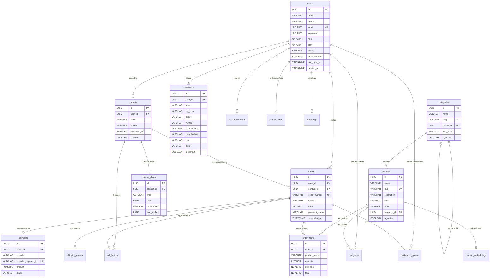

### 2.3 Index Strategy Summary

| Table | Index | Purpose |
|-------|-------|---------|
| `users` | `email`, `phone`, `status`, `role` | Auth lookups, admin filtering |
| `contacts` | `user_id`, `phone`, `whatsapp_id` | User contact list, WhatsApp lookup |
| `special_dates` | `date`, `type`, `last_notified`, composite `(date, type, last_notified)` | Notification scheduler queries |
| `products` | `slug`, `sku`, `category_id`, `is_active`, `price`, GIN full-text | Catalog browsing, search, filtering |
| `product_embeddings` | HNSW on `embedding` | Vector similarity search for RAG |
| `orders` | `user_id`, `status`, `created_at DESC`, `order_number` | Order lookups, admin dashboard |
| `notification_queue` | `(scheduled_at, status) WHERE status='PENDING'` | Scheduler polling |
| `payments` | `order_id`, `provider_payment_id`, `status` | Payment reconciliation |

---

## 3. Complete API Routes

### 3.1 Authentication Endpoints

| Method | Path | Auth | Request Body | Response | Status Codes |
|--------|------|------|-------------|----------|-------------|
| POST | `/v1/auth/register` | No | `RegisterRequest` | `AuthResponse` | 201, 400, 409, 429 |
| POST | `/v1/auth/login` | No | `LoginRequest` | `AuthResponse` | 200, 401, 429 |
| POST | `/v1/auth/logout` | Yes | — | `LogoutResponse` | 200, 401 |
| POST | `/v1/auth/refresh` | No | `RefreshTokenRequest` | `AuthResponse` | 200, 401, 429 |
| POST | `/v1/auth/forgot-password` | No | `ForgotPasswordRequest` | `PasswordResetResponse` | 200, 404, 429 |
| POST | `/v1/auth/reset-password` | No | `ResetPasswordRequest` | `PasswordResetResponse` | 200, 400, 429 |
| POST | `/v1/auth/validate-email` | No | `ValidateEmailRequest` | `ValidationResponse` | 200, 400, 429 |
| POST | `/v1/auth/validate-username` | No | `ValidateUsernameRequest` | `ValidationResponse` | 200 |
| GET | `/v1/auth/me` | Yes | — | `UserResponse` | 200, 401 |

**RegisterRequest:**
```json
{
  "name": "string (required, 2-100 chars)",
  "email": "string (required, valid email)",
  "password": "string (required, min 8 chars, 1 upper, 1 lower, 1 digit, 1 special)",
  "phone": "string (optional, E.164 format)"
}
```

**LoginRequest:**
```json
{
  "email": "string (required)",
  "password": "string (required)"
}
```

**AuthResponse:**
```json
{
  "accessToken": "JWT string",
  "refreshToken": "JWT string",
  "tokenType": "Bearer",
  "expiresIn": 900,
  "user": {
    "id": "UUID",
    "name": "string",
    "email": "string",
    "phone": "string",
    "role": "USER|ADMIN|CLIENT",
    "plan": "FREE|PREMIUM|BUSINESS"
  }
}
```

### 3.2 Contact Endpoints

| Method | Path | Auth | Request Body | Response | Status Codes |
|--------|------|------|-------------|----------|-------------|
| POST | `/v1/contacts` | Yes (USER) | `CreateContactRequest` | `ContactResponse` | 201, 400, 401 |
| GET | `/v1/contacts` | Yes (USER) | — | `List<ContactResponse>` | 200, 401 |
| GET | `/v1/contacts/{id}` | Yes (USER) | — | `ContactDetailResponse` | 200, 404, 401 |
| PUT | `/v1/contacts/{id}` | Yes (USER) | `UpdateContactRequest` | `ContactResponse` | 200, 400, 404, 401 |
| DELETE | `/v1/contacts/{id}` | Yes (USER) | — | — | 204, 404, 401 |
| POST | `/v1/contacts/{contactId}/special-dates` | Yes (USER) | `CreateSpecialDateRequest` | `SpecialDateResponse` | 201, 400, 404 |
| PUT | `/v1/contacts/{contactId}/special-dates/{dateId}` | Yes (USER) | `UpdateSpecialDateRequest` | `SpecialDateResponse` | 200, 400, 404 |
| DELETE | `/v1/contacts/{contactId}/special-dates/{dateId}` | Yes (USER) | — | — | 204, 404 |

**CreateContactRequest:**
```json
{
  "name": "string (required, 2-200 chars)",
  "phone": "string (optional, E.164)",
  "whatsappId": "string (optional)",
  "consent": "boolean (required)"
}
```

**CreateSpecialDateRequest:**
```json
{
  "type": "BIRTHDAY|ANNIVERSARY|CHRISTMAS|WEDDING|MOTHERS_DAY|FATHERS_DAY|VALENTINES_DAY|CUSTOM",
  "date": "YYYY-MM-DD (required)",
  "recurrence": "YEARLY|MONTHLY|ONCE"
}
```

### 3.3 Address Endpoints

| Method | Path | Auth | Request Body | Response | Status Codes |
|--------|------|------|-------------|----------|-------------|
| POST | `/v1/addresses` | Yes (USER) | `CreateAddressRequest` | `AddressResponse` | 201, 400, 401 |
| GET | `/v1/addresses` | Yes (USER) | — | `List<AddressResponse>` | 200, 401 |
| GET | `/v1/addresses/{id}` | Yes (USER) | — | `AddressResponse` | 200, 404, 401 |
| PUT | `/v1/addresses/{id}` | Yes (USER) | `UpdateAddressRequest` | `AddressResponse` | 200, 400, 404 |
| DELETE | `/v1/addresses/{id}` | Yes (USER) | — | — | 204, 404 |
| PATCH | `/v1/addresses/{id}/default` | Yes (USER) | — | `AddressResponse` | 200, 404 |

**CreateAddressRequest:**
```json
{
  "label": "string (required, e.g. 'Casa', 'Trabalho')",
  "zipCode": "string (required, 99999-999)",
  "street": "string (required)",
  "number": "string (required)",
  "complement": "string (optional)",
  "neighborhood": "string (required)",
  "city": "string (required)",
  "state": "string (required, 2 chars)",
  "reference": "string (optional)",
  "recipientPhone": "string (optional)",
  "isDefault": "boolean (optional, default false)"
}
```

### 3.4 Product & Category Endpoints

| Method | Path | Auth | Request Body | Response | Status Codes |
|--------|------|------|-------------|----------|-------------|
| GET | `/v1/products` | No | Query params | `Page<ProductResponse>` | 200 |
| GET | `/v1/products/{id}` | No | — | `ProductResponse` | 200, 404 |
| GET | `/v1/products/slug/{slug}` | No | — | `ProductResponse` | 200, 404 |
| POST | `/v1/products` | Yes (ADMIN) | `CreateProductRequest` | `ProductResponse` | 201, 400 |
| PUT | `/v1/products/{id}` | Yes (ADMIN) | `CreateProductRequest` | `ProductResponse` | 200, 400, 404 |
| DELETE | `/v1/products/{id}` | Yes (ADMIN) | — | — | 204, 404 |
| GET | `/v1/categories` | No | — | `List<CategoryResponse>` | 200 |
| GET | `/v1/categories/active` | No | — | `List<CategoryResponse>` | 200 |
| GET | `/v1/categories/{id}` | No | — | `CategoryResponse` | 200, 404 |
| GET | `/v1/categories/slug/{slug}` | No | — | `CategoryResponse` | 200, 404 |
| POST | `/v1/categories` | Yes (ADMIN) | `CreateCategoryRequest` | `CategoryResponse` | 201, 400 |
| PUT | `/v1/categories/{id}` | Yes (ADMIN) | `CreateCategoryRequest` | `CategoryResponse` | 200, 400, 404 |
| DELETE | `/v1/categories/{id}` | Yes (ADMIN) | — | — | 204, 404 |

**Product Query Params:**
| Param | Type | Description |
|-------|------|-------------|
| `search` | string | Full-text search on name + description |
| `categoryId` | UUID | Filter by category |
| `page` | int | Page number (default 0) |
| `size` | int | Page size (default 20) |
| `sort` | string | Sort field (default createdAt) |

### 3.5 Cart Endpoints

| Method | Path | Auth | Request Body | Response | Status Codes |
|--------|------|------|-------------|----------|-------------|
| GET | `/v1/cart` | Yes (USER) | — | `CartResponse` | 200, 401 |
| POST | `/v1/cart/items` | Yes (USER) | `AddToCartRequest` | `CartResponse` | 200, 400, 404 |
| PATCH | `/v1/cart/items/{productId}` | Yes (USER) | `UpdateCartItemRequest` | `CartResponse` | 200, 400, 404 |
| DELETE | `/v1/cart/items/{productId}` | Yes (USER) | — | `CartResponse` | 200, 404 |
| DELETE | `/v1/cart` | Yes (USER) | — | — | 204, 401 |

**AddToCartRequest:**
```json
{
  "productId": "UUID (required)",
  "quantity": "int (required, min 1, max 99)"
}
```

### 3.6 Order Endpoints (Client)

| Method | Path | Auth | Request Body | Response | Status Codes |
|--------|------|------|-------------|----------|-------------|
| POST | `/v1/client/orders` | Yes (USER) | `CreateOrderRequest` | `OrderDetailResponse` | 201, 400, 401 |
| GET | `/v1/client/orders` | Yes (USER) | Query params | `Page<OrderResponse>` | 200, 401 |
| GET | `/v1/client/orders/all` | Yes (USER) | — | `List<OrderResponse>` | 200, 401 |
| GET | `/v1/client/orders/{id}` | Yes (USER) | — | `OrderDetailResponse` | 200, 404, 401 |

**CreateOrderRequest:**
```json
{
  "contactId": "UUID (required)",
  "addressId": "UUID (optional, uses default if not provided)",
  "items": [
    {
      "productId": "UUID (required)",
      "quantity": "int (required)"
    }
  ],
  "message": "string (optional, gift message)",
  "scheduledAt": "ISO-8601 datetime (optional)",
  "paymentMethod": "PIX|CREDIT_CARD|DEBIT_CARD|BOLETO (required)"
}
```

### 3.7 Order Endpoints (Admin)

| Method | Path | Auth | Request Body | Response | Status Codes |
|--------|------|------|-------------|----------|-------------|
| GET | `/v1/orders` | Yes (ADMIN/MANAGER) | Query params | `Page<OrderResponse>` | 200, 403 |
| GET | `/v1/orders/recent` | Yes (ADMIN/MANAGER) | `?limit=5` | `List<OrderResponse>` | 200, 403 |
| GET | `/v1/orders/{id}` | Yes (ADMIN/MANAGER) | — | `OrderDetailResponse` | 200, 404, 403 |
| PATCH | `/v1/orders/{id}/status` | Yes (ADMIN/MANAGER) | `UpdateOrderStatusRequest` | `OrderDetailResponse` | 200, 400, 404 |

**UpdateOrderStatusRequest:**
```json
{
  "status": "PENDING|PROCESSING|SHIPPED|DELIVERED|CANCELLED|REFUNDED",
  "notes": "string (optional)",
  "trackingCode": "string (optional)"
}
```

### 3.8 Admin User Endpoints

| Method | Path | Auth | Request Body | Response | Status Codes |
|--------|------|------|-------------|----------|-------------|
| GET | `/v1/admin/users` | Yes (ADMIN/MANAGER) | Query params | `Page<AdminUserResponse>` | 200, 403 |
| GET | `/v1/admin/users/{id}` | Yes (ADMIN/MANAGER) | — | `AdminUserResponse` | 200, 404, 403 |
| GET | `/v1/admin/users/search?q=` | Yes (ADMIN/MANAGER) | — | `List<AdminUserResponse>` | 200, 403 |
| GET | `/v1/admin/users/stats` | Yes (ADMIN/MANAGER) | — | `UserStatsResponse` | 200, 403 |

### 3.9 Dashboard Endpoints

| Method | Path | Auth | Request Body | Response | Status Codes |
|--------|------|------|-------------|----------|-------------|
| GET | `/v1/dashboard/stats` | Yes (ADMIN) | `?period=month` | `DashboardStatsResponse` | 200, 403 |
| GET | `/v1/dashboard/sales` | Yes (ADMIN) | `?period=month` | `List<SalesDataResponse>` | 200, 403 |
| GET | `/v1/dashboard/top-products` | Yes (ADMIN) | `?period=month&limit=5` | `List<TopProductResponse>` | 200, 403 |

### 3.10 WhatsApp Endpoints (To Implement)

| Method | Path | Auth | Request Body | Response | Status Codes |
|--------|------|------|-------------|----------|-------------|
| POST | `/v1/whatsapp/webhook` | No (signature verified) | WhatsApp Cloud payload | 200 OK | 200, 400, 403 |
| POST | `/v1/whatsapp/send-message` | Yes (ADMIN) | `SendMessageRequest` | `MessageResponse` | 200, 400, 502 |
| POST | `/v1/whatsapp/template` | Yes (ADMIN) | `TemplateRequest` | `TemplateResponse` | 201, 400 |
| GET | `/v1/whatsapp/sessions/{phone}` | Yes (ADMIN) | — | `SessionResponse` | 200, 404 |

### 3.11 AI Endpoints (To Implement)

| Method | Path | Auth | Request Body | Response | Status Codes |
|--------|------|------|-------------|----------|-------------|
| POST | `/v1/ai/recommendations` | Yes (USER) | `RecommendationRequest` | `RecommendationResponse` | 200, 400, 502 |
| POST | `/v1/ai/generate-message` | Yes (USER) | `MessageGenRequest` | `MessageGenResponse` | 200, 400, 502 |
| POST | `/v1/ai/analyze-contact` | Yes (USER) | `AnalyzeContactRequest` | `AnalyzeContactResponse` | 200, 400, 502 |
| GET | `/v1/ai/conversations` | Yes (USER) | Query params | `Page<ConversationResponse>` | 200, 401 |

**RecommendationRequest:**
```json
{
  "contactId": "UUID (required)",
  "occasion": "string (optional)",
  "budgetMin": "number (optional)",
  "budgetMax": "number (optional)",
  "maxResults": "int (default 5)"
}
```

### 3.12 Payment Endpoints (To Implement)

| Method | Path | Auth | Request Body | Response | Status Codes |
|--------|------|------|-------------|----------|-------------|
| POST | `/v1/payments/create-intent` | Yes (USER) | `PaymentIntentRequest` | `PaymentIntentResponse` | 201, 400 |
| POST | `/v1/payments/webhook/{provider}` | No (signature verified) | Provider payload | 200 OK | 200, 400 |
| GET | `/v1/payments/{orderId}` | Yes (USER) | — | `PaymentResponse` | 200, 404 |
| POST | `/v1/payments/{orderId}/refund` | Yes (ADMIN) | `RefundRequest` | `RefundResponse` | 200, 400, 404 |

### 3.13 Shipping Endpoints (To Implement)

| Method | Path | Auth | Request Body | Response | Status Codes |
|--------|------|------|-------------|----------|-------------|
| POST | `/v1/shipping/calculate` | Yes (USER) | `ShippingCalcRequest` | `ShippingCalcResponse` | 200, 400 |
| GET | `/v1/shipping/track/{trackingCode}` | Yes (USER) | — | `TrackingResponse` | 200, 404 |
| POST | `/v1/shipping/webhook` | No (signature verified) | Carrier payload | 200 OK | 200, 400 |

---

## 4. Backend Package Structure

### 4.1 Complete Folder Structure

```
regalaya-api/src/main/java/br/com/regalaya/
│
├── RegalayaApiApplication.java
│
├── shared/                          # Cross-cutting concerns
│   ├── config/
│   │   ├── GlobalExceptionHandler.java
│   │   ├── OpenApiConfig.java
│   │   ├── SecurityConfig.java
│   │   ├── LocaleConfig.java
│   │   ├── AwsConfig.java
│   │   ├── RedisConfig.java
│   │   ├── WhatsAppConfig.java
│   │   ├── OpenAIConfig.java
│   │   ├── PaymentConfig.java
│   │   └── ShippingConfig.java
│   ├── domain/
│   │   └── BaseEntity.java
│   ├── exception/
│   │   ├── BusinessException.java
│   │   ├── ConflictException.java
│   │   ├── InvalidCredentialsException.java
│   │   ├── ResourceNotFoundException.java
│   │   ├── UnauthorizedException.java
│   │   └── ValidationException.java
│   ├── dto/
│   │   ├── ApiResponse.java
│   │   ├── ErrorResponse.java
│   │   └── PageResponse.java
│   └── util/
│       ├── PhoneUtils.java
│       ├── CurrencyUtils.java
│       └── SlugUtils.java
│
├── auth/                            # Authentication & Authorization
│   ├── controller/
│   │   ├── AuthController.java
│   │   └── AdminUserController.java
│   ├── domain/
│   │   └── model/
│   │       ├── User.java
│   │       ├── Role.java
│   │       ├── UserPlan.java
│   │       ├── AuditLog.java
│   │       └── RevokedToken.java
│   ├── repository/
│   │   ├── UserRepository.java
│   │   ├── AuditLogRepository.java
│   │   └── RevokedTokenRepository.java
│   ├── services/
│   │   ├── AuthService.java
│   │   └── impl/
│   │       └── AuthServiceImpl.java
│   ├── dto/
│   │   ├── requests/
│   │   │   ├── LoginRequest.java
│   │   │   ├── RegisterRequest.java
│   │   │   ├── RefreshTokenRequest.java
│   │   │   ├── ForgotPasswordRequest.java
│   │   │   ├── ResetPasswordRequest.java
│   │   │   ├── ValidateEmailRequest.java
│   │   │   └── ValidateUsernameRequest.java
│   │   └── responses/
│   │       ├── AuthResponse.java
│   │       ├── UserResponse.java
│   │       ├── AdminUserResponse.java
│   │       ├── LogoutResponse.java
│   │       ├── PasswordResetResponse.java
│   │       ├── TokenRefreshResponse.java
│   │       └── ValidationResponse.java
│   ├── mapper/
│   │   └── UserMapper.java
│   └── infrastructure/
│       ├── security/
│       │   ├── SecurityConfig.java
│       │   ├── UserDetailsImpl.java
│       │   └── UserDetailsServiceImpl.java
│       ├── jwt/
│       │   ├── JwtUtil.java
│       │   └── JwtAuthenticationFilter.java
│       ├── audit/
│       │   └── AuditService.java
│       ├── ratelimit/
│       │   └── RateLimitService.java
│       └── email/
│           └── EmailService.java
│
├── contact/                         # Contacts & Special Dates
│   ├── controller/
│   │   └── ContactController.java
│   ├── domain/
│   │   └── model/
│   │       ├── Contact.java
│   │       └── SpecialDate.java
│   ├── repository/
│   │   ├── ContactRepository.java
│   │   └── SpecialDateRepository.java
│   ├── services/
│   │   ├── service/
│   │   │   └── ContactService.java
│   │   └── impl/
│   │       └── ContactServiceImpl.java
│   ├── dto/
│   │   ├── requests/
│   │   │   ├── CreateContactRequest.java
│   │   │   ├── UpdateContactRequest.java
│   │   │   ├── CreateSpecialDateRequest.java
│   │   │   └── UpdateSpecialDateRequest.java
│   │   └── responses/
│   │       ├── ContactResponse.java
│   │       ├── ContactDetailResponse.java
│   │       └── SpecialDateResponse.java
│   ├── mapper/
│   │   └── ContactMapper.java
│   └── exception/
│       ├── ContactNotFoundException.java
│       └── SpecialDateNotFoundException.java
│
├── address/                         # User Addresses
│   ├── controller/
│   │   └── AddressController.java
│   ├── domain/
│   │   └── model/
│   │       └── Address.java
│   ├── repository/
│   │   └── AddressRepository.java
│   ├── services/
│   │   ├── service/
│   │   │   └── AddressService.java
│   │   └── impl/
│   │       └── AddressServiceImpl.java
│   ├── dto/
│   │   ├── requests/
│   │   │   ├── CreateAddressRequest.java
│   │   │   └── UpdateAddressRequest.java
│   │   └── responses/
│   │       └── AddressResponse.java
│   ├── mapper/
│   │   └── AddressMapper.java
│   └── exception/
│       └── AddressNotFoundException.java
│
├── category/                        # Product Categories
│   ├── controller/
│   │   └── CategoryController.java
│   ├── domain/
│   │   └── model/
│   │       └── Category.java
│   ├── repository/
│   │   └── CategoryRepository.java
│   ├── services/
│   │   ├── CategoryService.java
│   │   └── impl/
│   │       └── CategoryServiceImpl.java
│   ├── dto/
│   │   ├── requests/
│   │   │   └── CreateCategoryRequest.java
│   │   └── responses/
│   │       └── CategoryResponse.java
│   └── mapper/
│       └── CategoryMapper.java
│
├── product/                         # Products
│   ├── controller/
│   │   └── ProductController.java
│   ├── domain/
│   │   └── model/
│   │       └── Product.java
│   ├── repository/
│   │   └── ProductRepository.java
│   ├── services/
│   │   ├── ProductService.java
│   │   └── impl/
│   │       └── ProductServiceImpl.java
│   ├── dto/
│   │   ├── requests/
│   │   │   └── CreateProductRequest.java
│   │   └── responses/
│   │       └── ProductResponse.java
│   ├── mapper/
│   │   └── ProductMapper.java
│   └── exception/
│       └── ProductNotFoundException.java
│
├── cart/                            # Shopping Cart (Redis-backed)
│   ├── controller/
│   │   └── CartController.java
│   ├── domain/
│   │   └── model/
│   │       └── CartItem.java
│   ├── repository/
│   │   └── CartRepository.java
│   ├── services/
│   │   ├── service/
│   │   │   └── CartService.java
│   │   └── impl/
│   │       └── CartServiceImpl.java
│   ├── dto/
│   │   ├── requests/
│   │   │   ├── AddToCartRequest.java
│   │   │   └── UpdateCartItemRequest.java
│   │   └── responses/
│   │       ├── CartResponse.java
│   │       └── CartItemResponse.java
│   └── exception/
│       ├── CartItemNotFoundException.java
│       └── ProductNotAvailableException.java
│
├── order/                           # Orders
│   ├── controller/
│   │   ├── OrderController.java
│   │   └── ClientOrderController.java
│   ├── domain/
│   │   └── model/
│   │       ├── Order.java
│   │       ├── OrderItem.java
│   │       └── OrderStatus.java
│   ├── repository/
│   │   ├── OrderRepository.java
│   │   └── OrderItemRepository.java
│   ├── services/
│   │   ├── OrderService.java
│   │   └── impl/
│   │       └── OrderServiceImpl.java
│   ├── dto/
│   │   ├── requests/
│   │   │   ├── CreateOrderRequest.java
│   │   │   ├── CreateOrderItemRequest.java
│   │   │   └── UpdateOrderStatusRequest.java
│   │   └── responses/
│   │       ├── OrderResponse.java
│   │       ├── OrderDetailResponse.java
│   │       └── OrderItemResponse.java
│   ├── mapper/
│   │   └── OrderMapper.java
│   └── exception/
│       └── OrderNotFoundException.java
│
├── payment/                         # Payment Processing (To Implement)
│   ├── controller/
│   │   └── PaymentController.java
│   ├── domain/
│   │   └── model/
│   │       ├── Payment.java
│   │       └── PaymentStatus.java
│   ├── repository/
│   │   └── PaymentRepository.java
│   ├── services/
│   │   ├── PaymentService.java
│   │   ├── PaymentProvider.java          # Interface
│   │   └── impl/
│   │       ├── StripePaymentProvider.java
│   │       ├── MercadoPagoProvider.java
│   │       └── PaymentServiceImpl.java
│   ├── dto/
│   │   ├── requests/
│   │   │   ├── PaymentIntentRequest.java
│   │   │   └── RefundRequest.java
│   │   └── responses/
│   │       ├── PaymentIntentResponse.java
│   │       ├── PaymentResponse.java
│   │       └── RefundResponse.java
│   ├── mapper/
│   │   └── PaymentMapper.java
│   └── exception/
│       └── PaymentProcessingException.java
│
├── shipping/                        # Shipping & Tracking (To Implement)
│   ├── controller/
│   │   └── ShippingController.java
│   ├── domain/
│   │   └── model/
│   │       └── ShippingEvent.java
│   ├── repository/
│   │   └── ShippingEventRepository.java
│   ├── services/
│   │   ├── ShippingService.java
│   │   ├── ShippingProvider.java          # Interface
│   │   └── impl/
│   │       ├── CorreiosProvider.java
│   │       └── ShippingServiceImpl.java
│   ├── dto/
│   │   ├── requests/
│   │   │   └── ShippingCalcRequest.java
│   │   └── responses/
│   │       ├── ShippingCalcResponse.java
│   │       └── TrackingResponse.java
│   └── exception/
│       └── ShippingCalculationException.java
│
├── whatsapp/                        # WhatsApp Integration (To Implement)
│   ├── controller/
│   │   └── WhatsAppController.java
│   ├── domain/
│   │   └── model/
│   │       ├── WhatsAppSession.java
│   │       └── WhatsAppMessage.java
│   ├── repository/
│   │   ├── WhatsAppSessionRepository.java
│   │   └── WhatsAppMessageRepository.java
│   ├── services/
│   │   ├── WhatsAppService.java
│   │   └── impl/
│   │       └── WhatsAppServiceImpl.java
│   ├── dto/
│   │   ├── requests/
│   │   │   ├── SendMessageRequest.java
│   │   │   └── TemplateRequest.java
│   │   └── responses/
│   │       ├── MessageResponse.java
│   │       ├── SessionResponse.java
│   │       └── TemplateResponse.java
│   └── handler/
│       ├── WhatsAppWebhookHandler.java
│       ├── CommandHandler.java
│       └── impl/
│           ├── StartCommandHandler.java
│           ├── ContactCommandHandler.java
│           └── MenuCommandHandler.java
│
├── ai/                              # AI/ML Services (To Implement)
│   ├── controller/
│   │   └── AIController.java
│   ├── domain/
│   │   └── model/
│   │       ├── AIConversation.java
│   │       └── ProductEmbedding.java
│   ├── repository/
│   │   ├── AIConversationRepository.java
│   │   └── ProductEmbeddingRepository.java
│   ├── services/
│   │   ├── AIService.java
│   │   ├── EmbeddingService.java
│   │   └── impl/
│   │       ├── AIServiceImpl.java
│   │       └── EmbeddingServiceImpl.java
│   ├── dto/
│   │   ├── requests/
│   │   │   ├── RecommendationRequest.java
│   │   │   ├── MessageGenRequest.java
│   │   │   └── AnalyzeContactRequest.java
│   │   └── responses/
│   │       ├── RecommendationResponse.java
│   │       ├── MessageGenResponse.java
│   │       └── AnalyzeContactResponse.java
│   ├── prompt/
│   │   ├── recommendation-prompt.txt
│   │   ├── message-generation-prompt.txt
│   │   └── contact-analysis-prompt.txt
│   └── exception/
│       └── AIServiceException.java
│
├── notification/                    # Notification Scheduling (To Implement)
│   ├── scheduler/
│   │   ├── NotificationScheduler.java
│   │   └── MessageDispatchScheduler.java
│   ├── domain/
│   │   └── model/
│   │       └── NotificationQueue.java
│   ├── repository/
│   │   └── NotificationQueueRepository.java
│   ├── services/
│   │   ├── NotificationService.java
│   │   └── impl/
│   │       └── NotificationServiceImpl.java
│   └── dto/
│       └── NotificationPayload.java
│
├── gift/                            # Gift History (To Implement)
│   ├── domain/
│   │   └── model/
│   │       └── GiftHistory.java
│   ├── repository/
│   │   └── GiftHistoryRepository.java
│   └── services/
│       └── GiftHistoryService.java
│
├── content/                         # Content Management (To Implement)
│   ├── controller/
│   │   └── ContentController.java
│   ├── domain/
│   │   └── model/
│   │       └── ContentBanner.java
│   ├── repository/
│   │   └── ContentBannerRepository.java
│   ├── services/
│   │   ├── ContentService.java
│   │   └── impl/
│   │       └── ContentServiceImpl.java
│   └── dto/
│       ├── requests/
│       │   └── CreateBannerRequest.java
│       └── responses/
│           └── BannerResponse.java
│
├── webhook/                         # Webhook Processing (To Implement)
│   ├── controller/
│   │   └── WebhookController.java
│   ├── domain/
│   │   └── model/
│   │       └── WebhookLog.java
│   ├── repository/
│   │   └── WebhookLogRepository.java
│   ├── services/
│   │   ├── WebhookService.java
│   │   └── impl/
│   │       ├── PaymentWebhookHandler.java
│   │       └── ShippingWebhookHandler.java
│   └── dto/
│       └── WebhookPayload.java
│
└── dashboard/                       # Admin Dashboard
    ├── controller/
    │   └── DashboardController.java
    ├── repository/
    │   └── DashboardRepository.java
    ├── services/
    │   └── DashboardService.java
    └── dto/
        └── responses/
            ├── DashboardStatsResponse.java
            ├── SalesDataResponse.java
            └── TopProductResponse.java
```

### 4.2 Module Dependency Graph

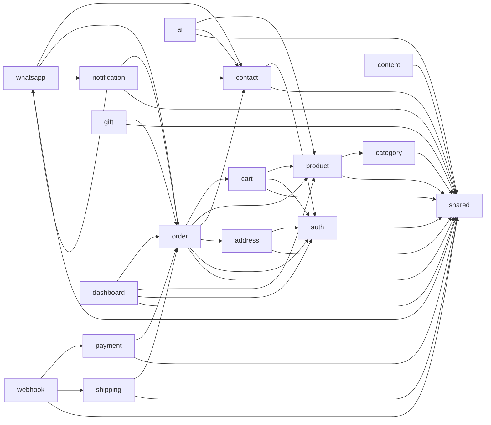

---

## 5. Security Architecture

### 5.1 Authentication Flow (JWT)

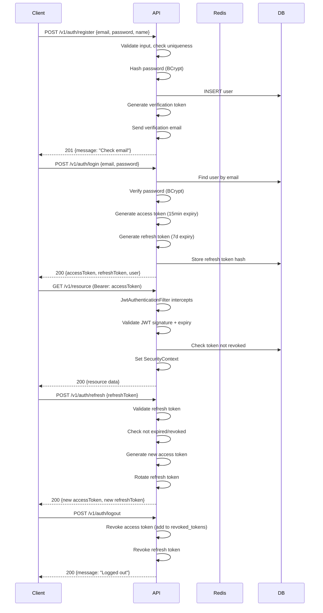

### 5.2 JWT Token Structure

**Access Token (15 minutes):**
```json
{
  "sub": "user-uuid",
  "iat": 1712500000,
  "exp": 1712500900,
  "jti": "unique-token-id",
  "role": "USER",
  "plan": "FREE",
  "type": "access"
}
```

**Refresh Token (7 days):**
```json
{
  "sub": "user-uuid",
  "iat": 1712500000,
  "exp": 1713104800,
  "jti": "unique-token-id",
  "type": "refresh"
}
```

### 5.3 Role-Based Access Control (RBAC)

| Role | Permissions | Accessible Endpoints |
|------|------------|---------------------|
| **CLIENT** | `ROLE_CLIENT`, `ROLE_READ_OWN_DATA`, `ROLE_CREATE_ORDERS`, `ROLE_READ_OWN_ORDERS` | Products (read), Cart, Own Orders, Contacts, Addresses |
| **USER** | `ROLE_USER`, `ROLE_READ_OWN_PROFILE`, `ROLE_UPDATE_OWN_PROFILE` + all CLIENT | Everything CLIENT + Profile management |
| **ADMIN** | `ROLE_ADMIN`, `ROLE_CREATE_USER`, `ROLE_READ_USER`, `ROLE_UPDATE_USER`, `ROLE_DELETE_USER`, `ROLE_MANAGE_SYSTEM` | All endpoints including admin routes |

### 5.4 Security Configuration Matrix

| Endpoint Pattern | Auth Required | Roles Allowed | Rate Limit |
|-----------------|--------------|---------------|------------|
| `/v1/auth/register` | No | — | 5 req/min per IP |
| `/v1/auth/login` | No | — | 10 req/min per IP |
| `/v1/auth/forgot-password` | No | — | 3 req/hour per email |
| `/v1/auth/refresh` | No | — | 10 req/min per IP |
| `/v1/auth/**` | No | — | 20 req/min per IP |
| `/v1/contacts/**` | Yes | USER, ADMIN | 60 req/min per user |
| `/v1/addresses/**` | Yes | USER, ADMIN | 60 req/min per user |
| `/v1/cart/**` | Yes | USER, ADMIN | 100 req/min per user |
| `/v1/client/orders/**` | Yes | USER, ADMIN | 30 req/min per user |
| `/v1/products` (GET) | No | — | 100 req/min per IP |
| `/v1/products` (POST/PUT/DELETE) | Yes | ADMIN | 30 req/min per user |
| `/v1/categories` (GET) | No | — | 100 req/min per IP |
| `/v1/categories` (POST/PUT/DELETE) | Yes | ADMIN | 30 req/min per user |
| `/v1/orders/**` | Yes | ADMIN, MANAGER | 60 req/min per user |
| `/v1/admin/**` | Yes | ADMIN, MANAGER | 60 req/min per user |
| `/v1/dashboard/**` | Yes | ADMIN | 30 req/min per user |
| `/v1/whatsapp/webhook` | No (sig verified) | — | — |
| `/v1/payments/webhook/**` | No (sig verified) | — | — |
| `/v1/ai/**` | Yes | USER, ADMIN | 10 req/min per user |
| `/actuator/**` | No | — | 30 req/min per IP |
| `/swagger-ui/**`, `/v3/api-docs/**` | No | — | 30 req/min per IP |

### 5.5 CORS Configuration

```java
// Production CORS - configured via app.cors.allowed-origins
allowedOrigins = [
    "https://regalaya.com.br",
    "https://admin.regalaya.com.br",
    "https://www.regalaya.com.br"
]
allowedMethods = ["GET", "POST", "PUT", "PATCH", "DELETE", "OPTIONS"]
allowedHeaders = ["*"]
exposedHeaders = ["Authorization", "Refresh-Token"]
allowCredentials = true
maxAge = 3600
```

### 5.6 Security Headers (via Spring Security)

| Header | Value |
|--------|-------|
| `X-Content-Type-Options` | `nosniff` |
| `X-Frame-Options` | `DENY` |
| `X-XSS-Protection` | `1; mode=block` |
| `Strict-Transport-Security` | `max-age=31536000; includeSubDomains` |
| `Content-Security-Policy` | `default-src 'self'` |
| `Referrer-Policy` | `strict-origin-when-cross-origin` |
| `Cache-Control` | `no-store` (for auth responses) |

### 5.7 Data Protection

| Data Type | Protection |
|-----------|-----------|
| Passwords | BCrypt (cost factor 12) |
| JWT Secrets | Environment variable, min 256 bits |
| Phone numbers in logs | Masked: `+55 11 9****-****` |
| Emails in logs | Masked: `j***@email.com` |
| Payment data | Never stored (handled by Stripe/MP) |
| PII in transit | TLS 1.3 |
| PII at rest | PostgreSQL column-level encryption (AES-256) for sensitive fields |

---

## 6. Integration Architecture

### 6.1 WhatsApp Cloud API Integration

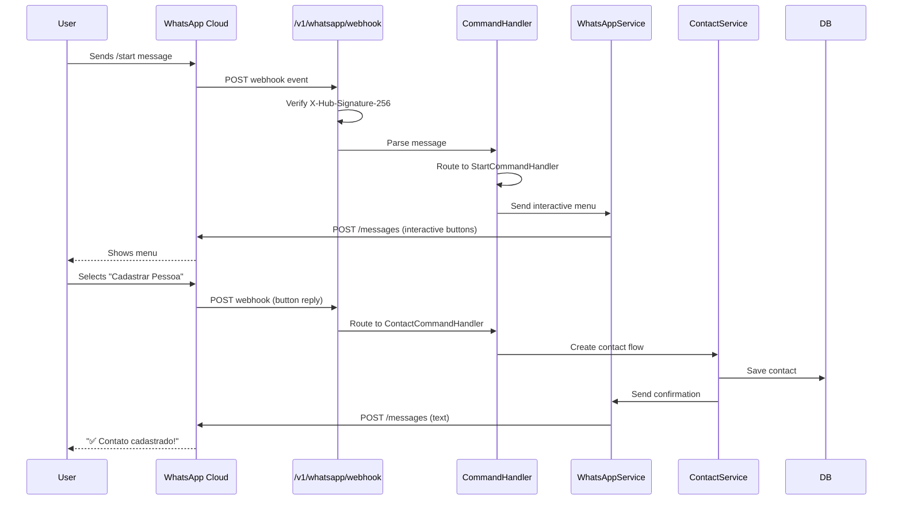

**WhatsApp Service Configuration:**
```yaml
app:
  whatsapp:
    api-url: https://graph.facebook.com/v18.0
    phone-number-id: ${WHATSAPP_PHONE_NUMBER_ID}
    access-token: ${WHATSAPP_ACCESS_TOKEN}
    verify-token: ${WHATSAPP_VERIFY_TOKEN}
    app-secret: ${WHATSAPP_APP_SECRET}
    template-language: pt_BR
    rate-limit:
      max-messages-per-second: 80
      retry-delay-ms: 1000
      max-retries: 3
```

### 6.2 OpenAI Integration (RAG + Recommendations)

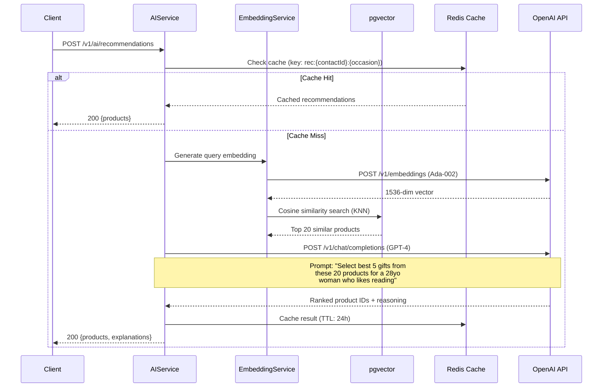

**AI Service Configuration:**
```yaml
app:
  openai:
    api-key: ${OPENAI_API_KEY}
    model: gpt-4
    embedding-model: text-embedding-ada-002
    max-tokens: 1000
    temperature: 0.7
    timeout: 30s
    retry:
      max-attempts: 3
      backoff-multiplier: 2
    cache:
      enabled: true
      ttl-hours: 24
```

### 6.3 Payment Integration (Stripe)

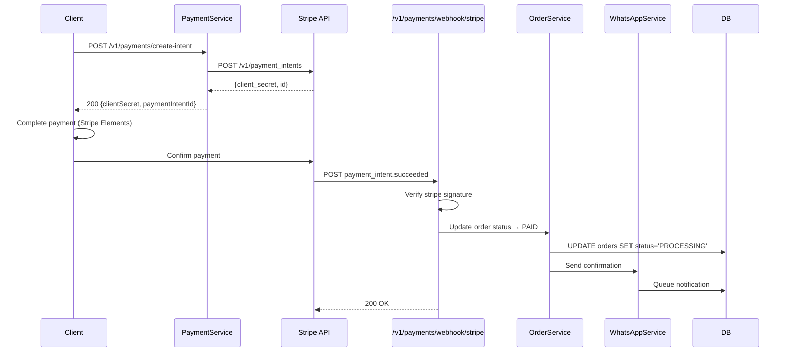

### 6.4 Shipping Integration (Correios)

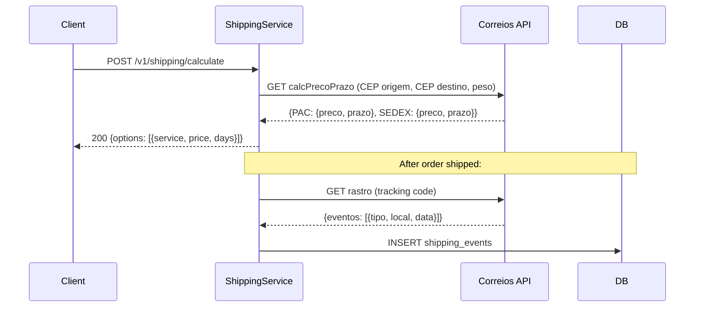

### 6.5 External Service Summary

| Service | Protocol | Auth | Timeout | Retry | Circuit Breaker |
|---------|----------|------|---------|-------|----------------|
| WhatsApp Cloud API | HTTPS REST | Bearer Token | 10s | 3x, exp backoff | Yes (fail after 5 failures) |
| OpenAI API | HTTPS REST | API Key | 30s | 3x, exp backoff | Yes (fail after 3 failures) |
| Stripe API | HTTPS REST | API Key | 15s | 2x, linear backoff | Yes (fail after 5 failures) |
| Correios API | HTTPS SOAP/REST | None | 10s | 2x, linear backoff | Yes (fail after 10 failures) |
| AWS S3 | HTTPS REST | IAM Credentials | 30s | 3x, exp backoff | Yes |
| Redis | TCP | Password | 1s | 1x | No (fallback to DB) |

---

## 7. Scheduler Architecture

### 7.1 Notification Scheduler

```mermaid
graph TB
    subgraph "Spring @Scheduled Tasks"
        DATE_CHECK[Date Reminder Checker<br/>Every hour: 0 0 * * * *]
        MSG_DISPATCH[Message Dispatcher<br/>Every minute: 0 * * * * *]
        FAILED_RETRY[Failed Message Retry<br/>Every 30 min: 0 */30 * * * *]
        CLEANUP[Token Cleanup<br/>Daily: 0 0 3 * * *]
    end

    subgraph "Date Reminder Checker"
        QUERY[Query special_dates WHERE<br/>date is 7d or 1d from now<br/>AND last_notified is NULL or old]
        CREATE[Create notification_queue<br/>entries for each match]
        UPDATE[Update last_notified on<br/>special_dates]
    end

    subgraph "Message Dispatcher"
        POLL[Poll notification_queue<br/>WHERE status='PENDING'<br/>AND scheduled_at <= NOW()]
        SEND[Send via WhatsAppService]
        UPDATE_STATUS[Update queue status<br/>SENT or FAILED]
    end

    DATE_CHECK --> QUERY
    QUERY --> CREATE
    CREATE --> UPDATE

    MSG_DISPATCH --> POLL
    POLL --> SEND
    SEND --> UPDATE_STATUS

    FAILED_RETRY --> POLL
    CLEANUP --> DB[(PostgreSQL)]

    CREATE --> DB
    POLL --> DB
    UPDATE_STATUS --> DB
    UPDATE --> DB
    SEND --> WA[WhatsApp API]
```

### 7.2 Scheduled Task Configuration

| Task | Cron Expression | Purpose | Max Execution |
|------|----------------|---------|--------------|
| `checkUpcomingDates` | `0 0 * * * *` (every hour) | Find special dates 7d and 1d away | 5 min |
| `dispatchPendingMessages` | `0 * * * * *` (every minute) | Send queued notifications | 2 min |
| `retryFailedMessages` | `0 */30 * * * *` (every 30 min) | Retry failed notifications (max 3) | 10 min |
| `cleanupExpiredTokens` | `0 0 3 * * *` (daily 3 AM) | Remove expired revoked tokens | 5 min |
| `cleanupOldAuditLogs` | `0 0 4 * * 0` (weekly Sunday 4 AM) | Archive audit logs older than 6 months | 15 min |
| `syncProductEmbeddings` | `0 0 2 * * *` (daily 2 AM) | Regenerate embeddings for new/updated products | 30 min |
| `cleanupInactiveCartItems` | `0 0 5 * * *` (daily 5 AM) | Remove cart items older than 30 days | 5 min |

### 7.3 Message Queue Processing Flow

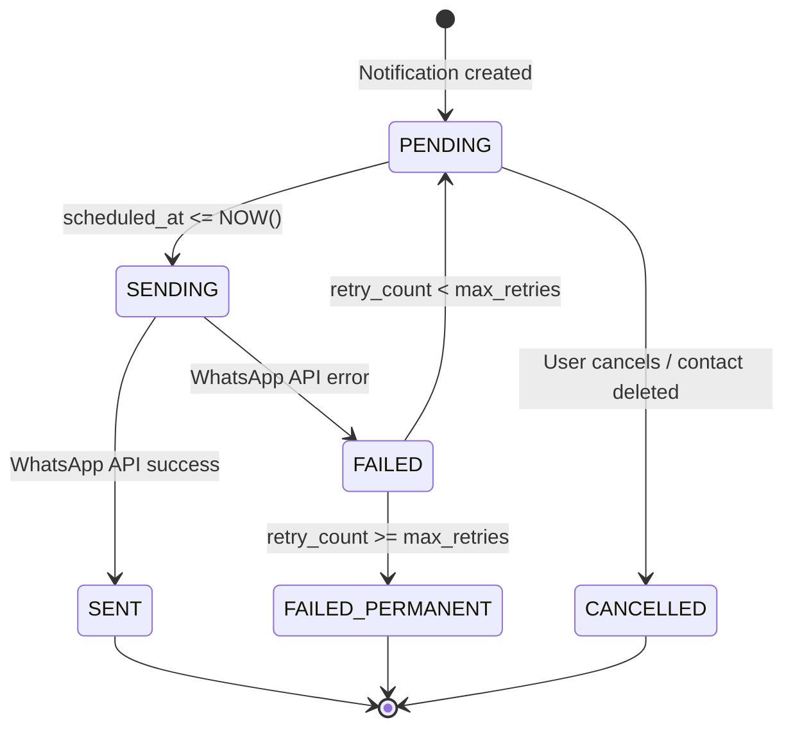

---

## 8. Data Flow Diagrams

### 8.1 Journey 1: First Access → Contact Registration (WhatsApp)

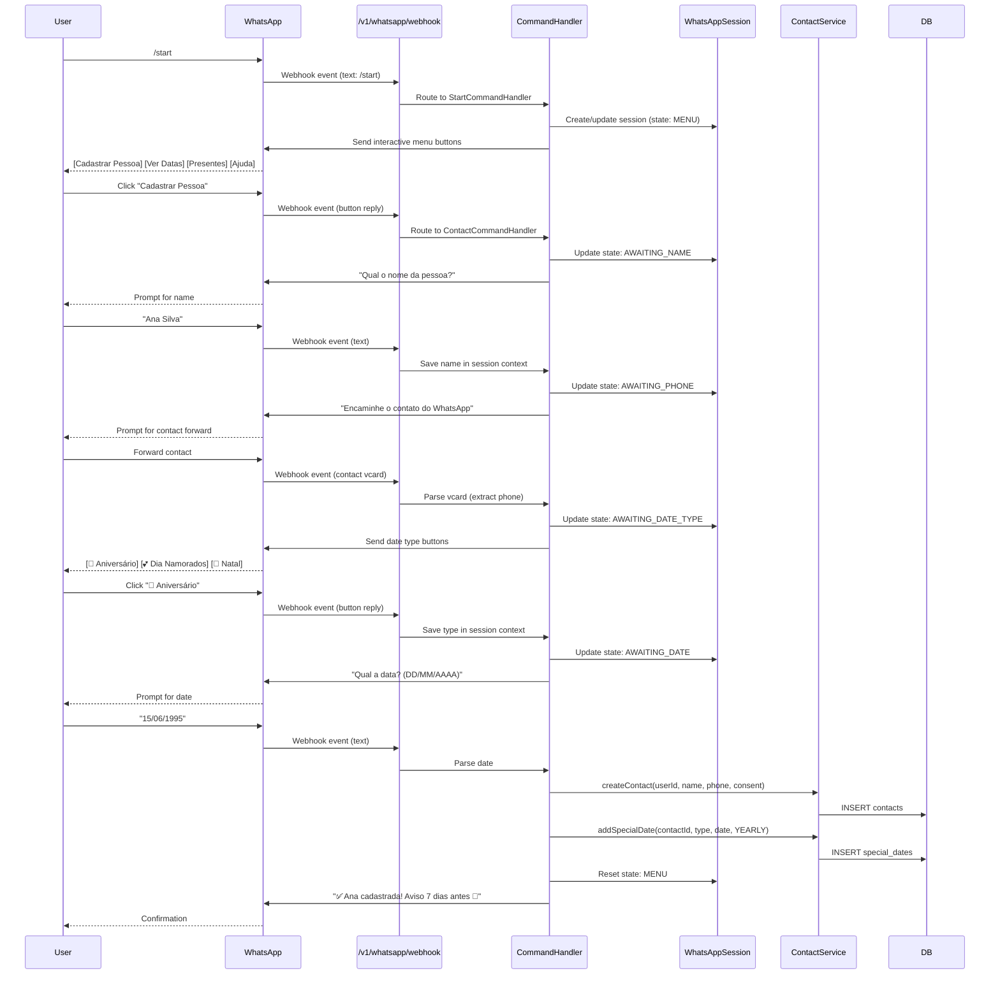

### 8.2 Journey 2: Notification → Purchase

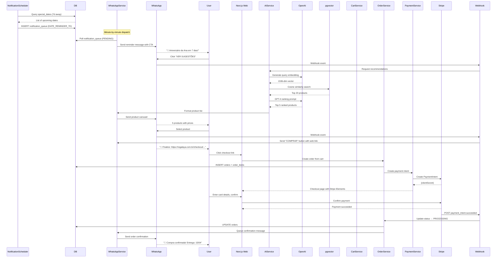

### 8.3 Journey 3: Admin → Product Management

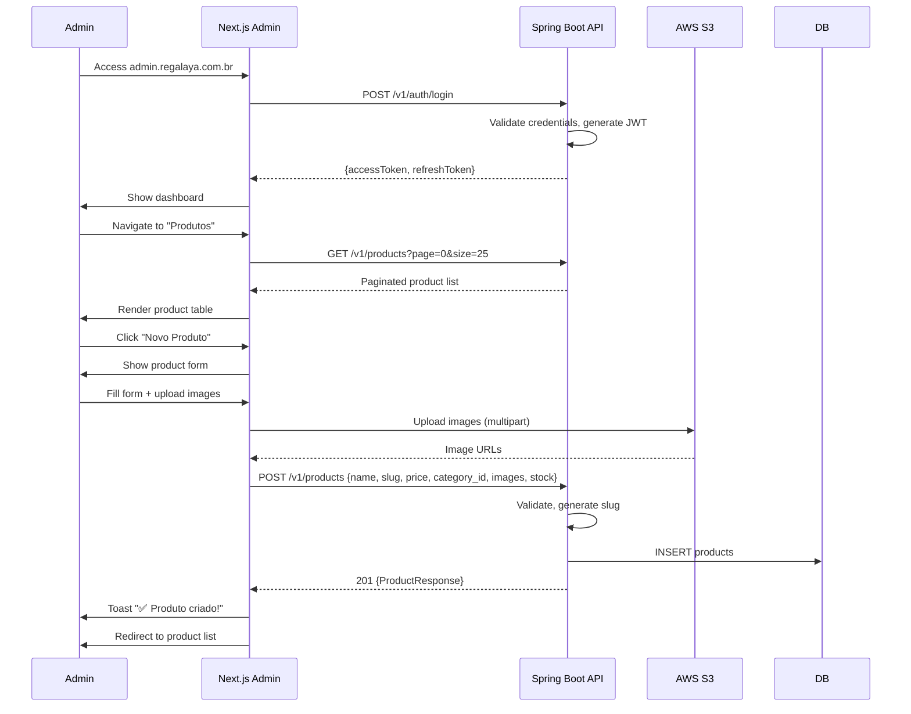

### 8.4 AI Recommendation Data Flow

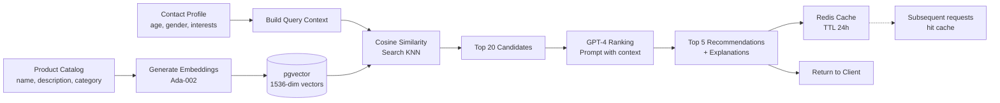

---

## 9. Redis Architecture

### 9.1 Redis Usage Patterns

| Key Pattern | Data Structure | TTL | Purpose |
|------------|---------------|-----|---------|
| `cart:{userId}` | Hash | 30 days | Shopping cart items |
| `cart:{userId}:items:{productId}` | Hash field | 30 days | Individual cart item |
| `rec:{contactId}:{occasion}:{budgetMin}-{budgetMax}` | JSON string | 24 hours | AI recommendation cache |
| `msg:{messageId}` | JSON string | 1 hour | AI-generated message cache |
| `ratelimit:auth:{ip}` | Counter | 1 minute | Auth rate limiting |
| `ratelimit:api:{userId}` | Counter | 1 minute | API rate limiting |
| `session:whatsapp:{phone}` | Hash | 24 hours | WhatsApp conversation state |
| `lock:order:{orderId}` | String (lock value) | 30 seconds | Distributed lock for order processing |
| `lock:payment:{paymentIntentId}` | String (lock value) | 60 seconds | Distributed lock for webhook processing |

### 9.2 Cart Data Structure (Redis Hash)

```
cart:user-{uuid}
├── {productId1} → {"quantity": 2, "addedAt": "2026-04-07T10:00:00Z"}
├── {productId2} → {"quantity": 1, "addedAt": "2026-04-07T10:05:00Z"}
└── _metadata → {"updatedAt": "2026-04-07T10:05:00Z", "itemCount": 2}
```

---

## 10. Deployment Architecture

### 10.1 Production Infrastructure

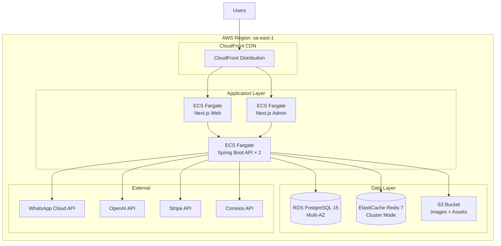

### 10.2 Environment Configuration

| Environment | Database | Redis | API URL | Web URL |
|------------|----------|-------|---------|---------|
| **Development** | Local PostgreSQL (Docker) | Local Redis (Docker) | `http://localhost:8080/api` | `http://localhost:3000` |
| **Staging** | RDS PostgreSQL (single) | ElastiCache (single) | `https://api-staging.regalaya.com.br` | `https://staging.regalaya.com.br` |
| **Production** | RDS PostgreSQL (Multi-AZ) | ElastiCache (cluster) | `https://api.regalaya.com.br` | `https://regalaya.com.br` |

### 10.3 Docker Compose (Development)

Already configured in `regalaya-api/docker-compose.yml`:
- **PostgreSQL 15** — port 5432
- **Redis 7** — port 6379
- **Mailpit** — SMTP port 1025, UI port 8025
- **LocalStack** — port 4566 (S3, SQS, SNS, SES)
- **pgAdmin** — port 5050 (profile: tools)
- **Redis Commander** — port 8081 (profile: tools)
- **Regalaya API** — port 8080

---

## 11. Error Handling Strategy

### 11.1 Global Exception Handler

| Exception | HTTP Status | Response Format |
|-----------|------------|----------------|
| `ResourceNotFoundException` | 404 | `{ "error": "NOT_FOUND", "message": "...", "timestamp": "..." }` |
| `BusinessException` | 400 | `{ "error": "BUSINESS_ERROR", "message": "...", "timestamp": "..." }` |
| `ConflictException` | 409 | `{ "error": "CONFLICT", "message": "...", "timestamp": "..." }` |
| `InvalidCredentialsException` | 401 | `{ "error": "INVALID_CREDENTIALS", "message": "...", "timestamp": "..." }` |
| `RateLimitExceededException` | 429 | `{ "error": "RATE_LIMIT", "message": "...", "retryAfter": 60 }` |
| `MethodArgumentNotValidException` | 400 | `{ "error": "VALIDATION", "message": "...", "fieldErrors": [...] }` |
| `UnauthorizedException` | 401 | `{ "error": "UNAUTHORIZED", "message": "..." }` |
| `AccessDeniedException` | 403 | `{ "error": "FORBIDDEN", "message": "..." }` |
| `PaymentProcessingException` | 402 | `{ "error": "PAYMENT_FAILED", "message": "...", "providerError": "..." }` |
| `AIServiceException` | 502 | `{ "error": "AI_SERVICE_ERROR", "message": "..." }` |
| `Exception` (unhandled) | 500 | `{ "error": "INTERNAL_ERROR", "message": "An unexpected error occurred" }` |

### 11.2 External Service Resilience

| Service | Circuit Breaker | Fallback | Timeout |
|---------|----------------|----------|---------|
| OpenAI | 5 failures → open 60s | Return cached results or "No recommendations available" | 30s |
| WhatsApp | 5 failures → open 30s | Queue message for retry | 10s |
| Stripe | 5 failures → open 60s | Return "Payment temporarily unavailable" | 15s |
| Correios | 10 failures → open 120s | Return flat rate R$ 29.90 | 10s |
| Redis | Connection failure | Fall back to database queries | 1s |

---

## 12. Monitoring & Observability

### 12.1 Spring Boot Actuator Endpoints

| Endpoint | Purpose | Auth |
|----------|---------|------|
| `/actuator/health` | Health check (DB, Redis connectivity) | No |
| `/actuator/metrics` | Application metrics | Yes (ADMIN) |
| `/actuator/prometheus` | Prometheus-format metrics | No (scraped by monitoring) |
| `/actuator/info` | Build info, version | No |

### 12.2 Key Metrics to Track

| Metric | Type | Alert Threshold |
|--------|------|----------------|
| `http.server.requests` (p95) | Duration | > 500ms |
| `jvm.memory.used` | Gauge | > 80% of max |
| `hikaricp.connections.active` | Gauge | > 80% of max |
| `redis.commands` (error rate) | Counter | > 5% error rate |
| `ai.recommendations.duration` | Duration | > 5s p95 |
| `whatsapp.messages.sent` | Counter | Track daily volume |
| `orders.created` | Counter | Track GMV |
| `orders.payment.failed` | Counter | > 10% failure rate |

---

## 13. Appendix

### 13.1 Enumerations

**User Roles:**
| Value | Description |
|-------|-------------|
| `ADMIN` | Full system access |
| `USER` | Standard user with profile management |
| `CLIENT` | Basic user (browse, order) |

**User Plans:**
| Value | Description |
|-------|-------------|
| `FREE` | Basic features, limited contacts |
| `PREMIUM` | Unlimited contacts, priority AI |
| `BUSINESS` | Bulk operations, API access |

**Special Date Types:**
| Value | Description |
|-------|-------------|
| `BIRTHDAY` | Aniversário |
| `ANNIVERSARY` | Aniversário de casamento |
| `CHRISTMAS` | Natal |
| `WEDDING` | Casamento |
| `MOTHERS_DAY` | Dia das Mães |
| `FATHERS_DAY` | Dia dos Pais |
| `VALENTINES_DAY` | Dia dos Namorados |
| `CUSTOM` | Data personalizada |

**Order Statuses:**
| Value | Description |
|-------|-------------|
| `PENDING` | Order created, awaiting payment |
| `PROCESSING` | Payment confirmed, preparing |
| `SHIPPED` | Package shipped |
| `DELIVERED` | Package delivered |
| `CANCELLED` | Order cancelled |
| `REFUNDED` | Order refunded |

**Payment Statuses:**
| Value | Description |
|-------|-------------|
| `pending` | Awaiting payment |
| `paid` | Payment confirmed |
| `failed` | Payment failed |
| `refunded` | Fully refunded |
| `partially_refunded` | Partially refunded |

### 13.2 API Versioning Strategy

All API endpoints are prefixed with `/v1/`. Versioning is URL-based:
- Current: `/v1/...`
- Future breaking changes: `/v2/...`
- Non-breaking additions: added to current version

### 13.3 Pagination Standard

All list endpoints follow consistent pagination:

**Request:**
```
GET /v1/products?page=0&size=20&sort=createdAt,desc
```

**Response:**
```json
{
  "content": [...],
  "page": 0,
  "size": 20,
  "totalElements": 150,
  "totalPages": 8,
  "first": true,
  "last": false
}
```

### 13.4 Idempotency

| Operation | Idempotency Key | Strategy |
|-----------|----------------|----------|
| Payment creation | `Idempotency-Key` header | Store key + result in Redis for 24h |
| Order creation | Request body hash | Check for duplicate within 5 min |
| WhatsApp message send | `messageId` | Deduplicate by message ID |

---

**Documento criado:** 07 de abril de 2026  
**Próxima revisão:** Após Sprint 3 (checkpoint de implementação)  
**Responsável:** System Architect + Tech Lead
