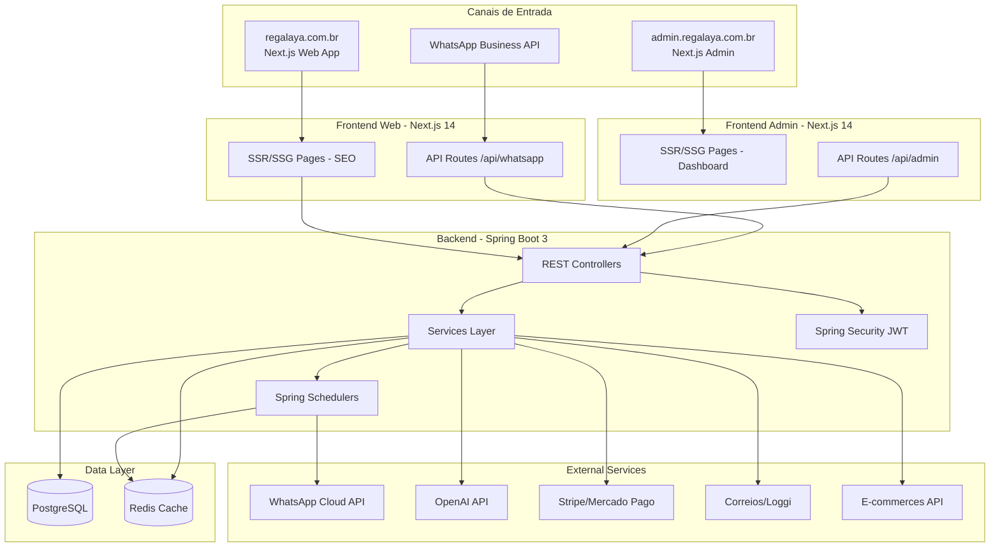
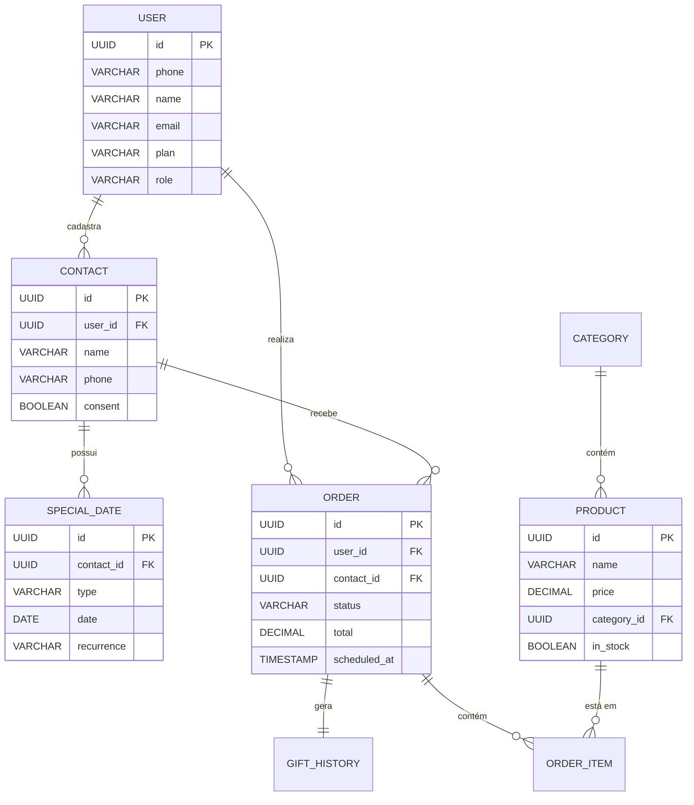

# Regalaya - PRD (Product Requirements Document)

**Versão:** 1.0  
**Data:** 28 de março de 2026  
**Status:** Pronto para desenvolvimento  

---

## 1. Visão do Produto

### 1.1 Problema

Profissionais ocupados (25-45 anos) enfrentam três desafios recorrentes ao presentear:

1. **Esquecimento de datas importantes** - Aniversários, Dia dos Namorados, Natal, datas pessoais
2. **Paralisia por escolha** - Milhões de opções de presentes geram ansiedade e decisões ruins
3. **Logística complexa** - Conseguir endereço, coordenar entrega e confirmar recebimento

**Impacto:**
- Relacionamentos prejudicados por esquecimentos
- Dinheiro gasto em presentes inadequados
- Estresse e tempo perdido em buscas intermináveis
- Presentes que chegam atrasados ou não chegam

### 1.2 Solução

Plataforma omnichannel que combina curadoria de presentes com IA, agendamento inteligente e entrega logística para resolver os três maiores problemas na hora de presentear.

**Pilares do Produto:**

| Pilar | Descrição | Tecnologia |
|-------|-----------|------------|
| **Monitoramento Inteligente** | Cadastro de pessoas e datas com notificações proativas | Agenda/Cofre de Memória |
| **Curadoria com IA** | Recomendação personalizada baseada em perfil + mensagem customizada | LLM + RAG |
| **Entrega Completa** | Resolução de endereço + envio WhatsApp + confirmação | WhatsApp API + Logística |

### 1.3 Proposta de Valor

> **"A única plataforma que resolve o ciclo completo de presentear: lembra, escolhe e entrega — tudo pelo WhatsApp."**

### 1.4 Personas

#### Persona Primária: "Carlos, o Executivo Ocupado"

| Atributo | Descrição |
|----------|-----------|
| **Idade** | 32 anos |
| **Ocupação** | Gerente de Vendas |
| **Renda** | R$ 15.000/mês |
| **Dor** | Trabalha 60h/semana, esquece datas importantes |
| **Objetivo** | Manter relacionamentos sem gastar tempo |
| **Comportamento** | Usa WhatsApp intensivamente, compra online |
| **Frustração** | Já esqueceu aniversário da namorada 2x |

#### Persona Secundária: "Juliana, a Organizada"

| Atributo | Descrição |
|----------|-----------|
| **Idade** | 28 anos |
| **Ocupação** | Designer Freelancer |
| **Renda** | R$ 8.000/mês |
| **Dor** | Quer presentear bem mas não tem tempo de buscar |
| **Objetivo** | Presentes criativos e significativos |
| **Comportamento** | Early adopter, valoriza curadoria |
| **Frustração** | Perde horas em e-commerces sem encontrar |

#### Persona Admin: "Roberto, o Gestor de E-commerce"

| Atributo | Descrição |
|----------|-----------|
| **Idade** | 35 anos |
| **Ocupação** | Admin de plataforma |
| **Renda** | R$ 12.000/mês |
| **Dor** | Precisa gerenciar produtos, pedidos e clientes manualmente |
| **Objetivo** | Dashboard unificado e relatórios automáticos |
| **Comportamento** | Usa múltiplas ferramentas, valoriza automação |
| **Frustração** | Perde tempo consolidando dados de fontes diferentes |

---

## 2. Objetivos e Métricas

### 2.1 North Star Metric

**Presentes Entregues com Sucesso por Mês**

### 2.2 OKRs MVP

| Objetivo | Key Results |
|----------|-------------|
| **Validar produto** | 500 usuários ativos, 50 compras em 90 dias |
| **Engajamento** | 40% de usuários retornam em 30 dias |
| **Receita** | R$ 50.000 em GMV no primeiro trimestre |
| **Satisfação** | NPS > 50, churn < 5% |

### 2.3 KPIs

| Métrica | Meta M1 | Meta M6 | Meta M12 |
|---------|---------|---------|----------|
| Usuários ativos mensais | 500 | 5.000 | 25.000 |
| Taxa de conversão (free → premium) | 3% | 5% | 8% |
| Ticket médio por presente | R$ 250 | R$ 300 | R$ 350 |
| NPS | 50 | 60 | 70 |
| Churn mensal | <5% | <4% | <3% |
| LTV:CAC | 2:1 | 3:1 | 4:1 |

---

## 3. Funcionalidades

### 3.1 Funcionalidades MVP (MoSCoW)

#### Must Have (Obrigatórias - MVP)

**Gestão de Pessoas Queridas:**
- MH-01: Cadastro de contato (nome + WhatsApp)
- MH-02: Tipos de data (aniversário, Dia dos Namorados, Natal, casamento)
- MH-03: Recorrência automática
- MH-04: Notificação push/WhatsApp (7 dias e 1 dia antes)

**Curadoria de Presentes com IA:**
- MH-05: Catálogo básico (50-100 SKUs)
- MH-06: Recomendação por perfil (IA sugere baseado em idade/gênero/interesse)
- MH-07: Mensagem personalizada (IA gera texto para WhatsApp)
- MH-08: Filtros básicos (preço, categoria, ocasião)

**Agendamento e Entrega:**
- MH-09: Agendamento de envio (escolher data/hora do WhatsApp)
- MH-10: Coleta de endereço (fluxo conversacional)
- MH-11: Integração entrega (API com 1-2 parceiros)
- MH-12: Confirmação de entrega (notificação quando entregue)

**Acesso via WhatsApp:**
- MH-13: Bot WhatsApp (inicia fluxo pelo WhatsApp)
- MH-14: Envio de contato (forward de contato do WhatsApp)
- MH-15: Fluxo conversacional (menu interativo com botões)

**Infraestrutura Básica:**
- MH-16: Autenticação (login com telefone/OTP)
- MH-17: Pagamento (integração Stripe/Mercado Pago)
- MH-18: Dashboard básico (web app para gestão)

**Backoffice Admin (Completo):**
- MH-19: Gestão de Produtos (CRUD, categorias, estoque, upload imagens)
- MH-20: Gestão de Pedidos (lista, status tracking, reembolsos, exportação)
- MH-21: Gestão de Clientes (lista, histórico, segmentação, comunicação)
- MH-22: Gestão de Conteúdo (banners, páginas institucionais, blog SEO)
- MH-23: Analytics Dashboard (vendas, conversão, relatórios, cohort analysis)
- MH-24: Configurações Admin (usuários, permissões RBAC, integrações, webhooks)

#### Should Have (Fase 2 - Meses 4-6)

- SH-01: Múltiplas datas customizadas
- SH-02: Catálogo expandido (500+ presentes)
- SH-03: IA de recomendação avançada (fine-tuning com histórico)
- SH-04: Rastreamento de entrega em tempo real
- SH-05: Programa de afiliados
- SH-06: Planos de assinatura (Free, Premium, Business)
- SH-07: Webhooks de entrega (status update automático)
- SH-08: Relatórios de gastos
- SH-09: Exportação de dados (CSV/Excel)
- SH-10: Notificações push web

#### Could Have (Fase 3 - Meses 7-12)

- CH-01: Cofre de Memória (histórico completo com fotos e mensagens)
- CH-02: Sugestões baseadas em anos anteriores
- CH-03: Integração com e-commerces via API
- CH-04: App nativo (iOS/Android)
- CH-05: White-label para empresas (B2B)
- CH-06: Gift cards digitais
- CH-07: Lista de desejos
- CH-08: Embalagem premium (upsell)
- CH-09: Blog SEO (conteúdo orgânico)
- CH-10: Programa de pontos (fidelidade)

#### Won't Have (Por enquanto)

- WH-01: Entrega própria (logística in-house)
- WH-02: Marketplace próprio
- WH-03: Criptomoeda como pagamento
- WH-04: Internacionalização
- WH-05: IA de voz

---

## 4. Requisitos Funcionais

### 4.1 E-commerce (Web)

| ID | Requisito | Prioridade | Critérios de Aceite |
|----|-----------|------------|---------------------|
| RF-001 | Usuário deve poder visualizar catálogo de presentes | Must | Catálogo com 50-100 produtos, filtros, busca |
| RF-002 | Usuário deve poder ver detalhes do produto | Must | Fotos, descrição, preço, reviews |
| RF-003 | Usuário deve poder adicionar ao carrinho | Must | Carrinho persistente, edição de quantidade |
| RF-004 | Usuário deve poder finalizar compra | Must | Checkout em até 3 passos |
| RF-005 | Sistema deve calcular frete automaticamente | Must | Integração Correios/Loggi em tempo real |
| RF-006 | Usuário deve poder pagar com PIX/cartão | Must | Stripe/Mercado Pago integrado |
| RF-007 | Sistema deve enviar confirmação por email/WhatsApp | Must | Template de confirmação enviado |
| RF-008 | Usuário deve poder rastrear pedido | Should | Tracking em tempo real |

### 4.2 Backoffice Admin

| ID | Requisito | Prioridade | Critérios de Aceite |
|----|-----------|------------|---------------------|
| RF-101 | Admin deve poder CRUD de produtos | Must | Criar, editar, excluir, listar produtos |
| RF-102 | Admin deve poder gerenciar categorias | Must | Hierarquia de categorias, produtos por categoria |
| RF-103 | Admin deve poder controlar estoque | Must | Alerta de estoque baixo, histórico de movimentação |
| RF-104 | Admin deve poder fazer upload de imagens | Must | Upload múltiplo, resize automático, CDN |
| RF-105 | Admin deve visualizar lista de pedidos | Must | Filtros por status, data, cliente |
| RF-106 | Admin deve alterar status de pedido | Must | Fluxo: Pendente → Pago → Enviado → Entregue |
| RF-107 | Admin deve processar reembolsos | Must | Reembolso parcial/total, justificativa |
| RF-108 | Admin deve exportar pedidos (CSV/Excel) | Should | Exportação com filtros aplicados |
| RF-109 | Admin deve visualizar lista de clientes | Must | Dados, histórico de compras, segmentação |
| RF-110 | Admin deve enviar comunicação para clientes | Should | Email/WhatsApp em massa, templates |
| RF-111 | Admin deve gerenciar banners da homepage | Must | Upload, agendamento, ordem de exibição |
| RF-112 | Admin deve criar páginas institucionais | Should | Editor WYSIWYG, SEO básico |
| RF-113 | Admin deve visualizar dashboard de vendas | Must | Gráficos, KPIs, período customizável |
| RF-114 | Admin deve visualizar métricas de conversão | Must | Funil de vendas, abandono de carrinho |
| RF-115 | Admin deve gerar relatórios customizados | Should | Filtros, agrupamentos, exportação |
| RF-116 | Admin deve visualizar cohort analysis | Should | Retenção por semana/mês de cadastro |
| RF-117 | Admin deve CRUD de usuários admin | Must | Criar, editar, desativar usuários |
| RF-118 | Sistema deve ter RBAC (roles e permissões) | Must | Admin, Manager, Viewer |
| RF-119 | Admin deve configurar integrações | Must | WhatsApp, OpenAI, Stripe, Correios |
| RF-120 | Admin deve gerenciar webhooks | Should | Logs de webhooks, retry manual |

### 4.3 Bot WhatsApp

| ID | Requisito | Prioridade | Critérios de Aceite |
|----|-----------|------------|---------------------|
| RF-201 | Usuário deve iniciar bot com /start | Must | Mensagem de boas-vindas com menu |
| RF-202 | Usuário deve poder cadastrar contato via WhatsApp | Must | Fluxo: nome → telefone → data |
| RF-203 | Usuário deve poder encaminhar contato do WhatsApp | Must | Extração automática de nome e telefone |
| RF-204 | Sistema deve enviar notificação de data próxima | Must | 7 dias e 1 dia antes, com link para ação |
| RF-205 | Usuário deve receber sugestões de presentes | Must | 3-5 opções com fotos e preços |
| RF-206 | Usuário deve poder selecionar presente pelo WhatsApp | Must | Botões numerados ou texto |
| RF-207 | Sistema deve gerar mensagem personalizada com IA | Must | Texto único, emocional, contextual |
| RF-208 | Usuário deve poder agendar envio da mensagem | Must | Seleção de data/hora, confirmação |
| RF-209 | Sistema deve coletar endereço via conversa | Must | Fluxo: CEP → número → complemento |
| RF-210 | Sistema deve confirmar entrega | Must | Notificação quando destinatário receber |

### 4.4 Agendamento e IA

| ID | Requisito | Prioridade | Critérios de Aceite |
|----|-----------|------------|---------------------|
| RF-301 | Sistema deve notificar usuário sobre datas próximas | Must | Spring Scheduler, timezone-aware |
| RF-302 | Sistema deve gerar recomendações com IA | Must | OpenAI GPT-4, 3-5 sugestões relevantes |
| RF-303 | Sistema deve usar RAG para recomendações | Must | pgvector, histórico do usuário |
| RF-304 | Sistema deve gerar mensagem emocional com IA | Must | Tom adequado à ocasião e relacionamento |
| RF-305 | Sistema deve cachear respostas de IA | Must | Redis, TTL 24h |
| RF-306 | Sistema deve agendar mensagens para envio futuro | Must | Fila de envio, retry em caso de falha |
| RF-307 | Sistema deve respeitar limite de taxa da API WhatsApp | Must | Rate limiting, backoff exponencial |

---

## 5. Requisitos Não-Funcionais

### 5.1 Performance

| ID | Requisito | Meta |
|----|-----------|------|
| RNF-001 | Tempo de carregamento da homepage | < 2s (p95) |
| RNF-002 | Tempo de resposta da API | < 300ms (p95) |
| RNF-003 | Tempo de geração de recomendação IA | < 3s (p95) |
| RNF-004 | Tempo de envio de mensagem WhatsApp | < 5s (p95) |
| RNF-005 | Throughput da API | 500 req/s |
| RNF-006 | SEO Lighthouse score | > 90 |

### 5.2 Segurança

| ID | Requisito | Implementação |
|----|-----------|---------------|
| RNF-007 | Autenticação segura | JWT com expiração 15min, refresh token rotativo |
| RNF-008 | Autorização RBAC | Spring Security, roles USER/ADMIN |
| RNF-009 | Criptografia em repouso | AES-256 no banco de dados |
| RNF-010 | Criptografia em trânsito | TLS 1.3 em todas as comunicações |
| RNF-011 | Proteção contra SQL injection | JPA/Hibernate (prepared statements) |
| RNF-012 | Proteção contra XSS | React auto-escape, CSP headers |
| RNF-013 | Proteção contra CSRF | Tokens CSRF em forms |
| RNF-014 | Rate limiting | 100 req/min por IP/telefone |
| RNF-015 | Gestão de secrets | AWS Secrets Manager |
| RNF-016 | Logs sem dados sensíveis | Mascaramento de telefones, emails |

### 5.3 Disponibilidade

| ID | Requisito | Meta |
|----|-----------|------|
| RNF-017 | Disponibilidade do frontend | 99.9% (43min downtime/mês) |
| RNF-018 | Disponibilidade da API | 99.9% (43min downtime/mês) |
| RNF-019 | Disponibilidade do WhatsApp | 98% (14h downtime/mês) |
| RNF-020 | RTO (Recovery Time Objective) | < 1 hora |
| RNF-021 | RPO (Recovery Point Objective) | < 15 minutos |
| RNF-022 | Backup do banco de dados | Diário, retenção 30 dias |

---

## 6. Arquitetura Técnica

### 6.1 Stack Tecnológico

**Frontend Web (Next.js 14) - Loja Virtual:**
- Next.js 14 (App Router)
- React 18
- TypeScript
- Tailwind CSS
- shadcn/ui (componentes)
- Zustand (estado)
- Axios/tRPC (API)
- React Hook Form + Zod (forms)

**Frontend Admin (Next.js 14) - Painel Admin:**
- Next.js 14 (App Router)
- React 18
- TypeScript
- Tailwind CSS
- shadcn/ui (componentes)
- Zustand (estado)
- Axios/tRPC (API)
- React Hook Form + Zod (forms)

**IMPORTANTE:** Web e Admin são aplicações independentes com:
- Domínios/subdomínios diferentes
- Repositórios Git separados
- Autenticação completamente isolada
- Middleware de proteção para evitar acesso de clientes

**Backend (Spring Boot 3):**
- Spring Boot 3.2+
- Java 21
- Spring Security + JWT
- Spring Data JPA + Hibernate
- Spring Scheduler
- Spring Cache + Redis
- Springdoc OpenAPI
- JUnit 5 + Mockito (testes)
- Lombok

**IA / ML:**
- OpenAI GPT-4 / Anthropic Claude
- OpenAI Java SDK
- OpenAI Ada-002 (embeddings)
- PostgreSQL pgvector (RAG)

**Infraestrutura:**
- AWS (ECS Fargate, RDS, ElastiCache, S3, CloudFront)
- Docker
- PostgreSQL 15+
- Redis 7+
- Vercel (Next.js hosting - opcional)

### 6.2 Diagrama de Arquitetura



> **Nota:** Web e Admin são aplicações Next.js **totalmente independentes**:
> - Subdomínios diferentes: `regalaya.com.br` (Web) e `admin.regalaya.com.br` (Admin)
> - Repositórios Git separados
> - Autenticação isolada com proteção de rotas

### 6.3 Integrações

| Serviço | Finalidade | Custo Estimado |
|---------|------------|----------------|
| WhatsApp Cloud API | Envio de mensagens | R$ 0,10/conversa |
| OpenAI API | Geração de recomendações e mensagens | R$ 0,02-0,10/requisição |
| Stripe/Mercado Pago | Processamento de pagamentos | 2.9% + R$ 0,50 |
| Correios/Loggi | Cálculo de frete e entrega | Variável por peso/distância |

---

## 7. Modelo de Dados

### 7.1 Entidades Principais

**User (Usuário)**
- id (UUID, PK)
- phone (VARCHAR, unique)
- name (VARCHAR)
- email (VARCHAR, unique)
- plan (VARCHAR: FREE, PREMIUM, BUSINESS)
- role (VARCHAR: USER, ADMIN)
- created_at (TIMESTAMP)
- updated_at (TIMESTAMP)
- last_login_at (TIMESTAMP)

**Contact (Pessoa Querida)**
- id (UUID, PK)
- user_id (UUID, FK → users)
- name (VARCHAR)
- phone (VARCHAR)
- whatsapp_id (VARCHAR)
- consent (BOOLEAN)
- created_at (TIMESTAMP)

**SpecialDate (Data Especial)**
- id (UUID, PK)
- contact_id (UUID, FK → contacts)
- type (VARCHAR: BIRTHDAY, ANNIVERSARY, CHRISTMAS, WEDDING)
- date (DATE)
- recurrence (VARCHAR: YEARLY, MONTHLY, ONCE)
- last_notified (DATE)
- created_at (TIMESTAMP)

**Product (Produto)**
- id (UUID, PK)
- ecommerce_id (VARCHAR)
- name (VARCHAR)
- description (TEXT)
- price (DECIMAL)
- category_id (UUID, FK → categories)
- image_url (TEXT)
- in_stock (BOOLEAN)
- metadata (JSONB)
- created_at (TIMESTAMP)
- updated_at (TIMESTAMP)

**Order (Pedido)**
- id (UUID, PK)
- user_id (UUID, FK → users)
- contact_id (UUID, FK → contacts)
- status (VARCHAR: PENDING, PAID, SHIPPED, DELIVERED, CANCELLED)
- total (DECIMAL)
- delivery_address (JSONB)
- message (TEXT)
- scheduled_at (TIMESTAMP)
- created_at (TIMESTAMP)
- completed_at (TIMESTAMP)

**GiftHistory (Histórico de Presentes)**
- id (UUID, PK)
- order_id (UUID, FK → orders)
- message (TEXT)
- delivered_at (TIMESTAMP)
- rating (INTEGER)
- created_at (TIMESTAMP)

### 7.2 Diagrama ER



---

## 8. UX/UI

### 8.1 User Journeys

**Jornada 1: Primeiro Acesso → Cadastro de Pessoa**
```
1. Usuário acessa WhatsApp
2. Envia /start para o bot
3. Recebe boas-vindas e menu
4. Seleciona "Cadastrar pessoa"
5. Informa nome da pessoa
6. Envia contato do WhatsApp (forward)
7. Seleciona tipo de data (aniversário, etc.)
8. Informa data
9. Confirma cadastro
10. Recebe confirmação
```

**Jornada 2: Notificação → Compra**
```
1. Sistema notifica (7 dias antes)
2. Usuário clica "Ver presentes"
3. Visualiza 3-5 sugestões da IA
4. Seleciona presente
5. Visualiza detalhes
6. Clica "Comprar"
7. Preenche endereço (ou usa padrão)
8. Escolhe forma de pagamento
9. Completa checkout
10. Recebe confirmação
```

**Jornada 3: Admin → Gestão de Produtos**
```
1. Admin acessa dashboard (/admin)
2. Faz login com credenciais
3. Navega para "Produtos"
4. Visualiza lista de produtos
5. Clica "Novo Produto"
6. Preenche formulário (nome, descrição, preço, etc.)
7. Faz upload de imagens
8. Seleciona categoria
9. Salva produto
10. Produto aparece no catálogo
```

### 8.2 Wireframes

**Homepage (E-commerce):**
- Header: Logo, Busca, Carrinho, Login
- Hero: Banner promocional
- Categorias: Grid com categorias principais
- Destaques: Produtos recomendados pela IA
- Footer: Links institucionais, redes sociais

**Dashboard Admin:**
- Sidebar: Menu (Dashboard, Produtos, Pedidos, Clientes, Conteúdo, Configurações)
- Topbar: Busca, Notificações, Perfil
- Content Area: KPIs, Gráficos, Tabelas recentes

**Fluxo WhatsApp:**
- Menu inicial: Botões (Cadastrar pessoa, Ver datas, Presentes, Ajuda)
- Cadastro: Passo a passo conversacional
- Notificação: Mensagem com foto do presente e CTA

---

## 9. Roadmap

### 9.1 MVP (90 dias)

| Sprint | Duração | Entregas |
|--------|---------|----------|
| **Sprint 1-2** | Semanas 1-4 | Setup Next.js + Spring Boot, Auth, CRUD Contatos/Datas |
| **Sprint 3-4** | Semanas 5-8 | Catálogo, IA de recomendação, Gestão de Produtos (Admin) |
| **Sprint 5-6** | Semanas 9-12 | Agendamento, Coleta de endereço, Integração entrega, Gestão de Pedidos (Admin) |
| **Sprint 7-8** | Semanas 13-16 | Bot WhatsApp, Pagamento, Gestão de Clientes (Admin) |
| **Sprint 9** | Semanas 17-18 | Dashboard Web, Analytics, Configurações (Admin) |
| **Sprint 10** | Semanas 19-20 | Beta com 50 usuários, Bug fixes, Otimizações |

### 9.2 Pós-MVP

**Fase 2 (Meses 4-6):**
- Catálogo expandido (500+ produtos)
- IA avançada (fine-tuning)
- Rastreamento em tempo real
- Planos de assinatura
- Notificações push web

**Fase 3 (Meses 7-12):**
- Cofre de Memória
- App nativo (iOS/Android)
- White-label B2B
- Programa de afiliados
- Blog SEO

---

## 10. Riscos e Dependências

### 10.1 Riscos Técnicos

| Risco | Impacto | Probabilidade | Mitigação |
|-------|---------|---------------|-----------|
| WhatsApp API cara | Alto | Alta | Otimizar conversas, usar templates eficientes |
| IA gera recomendações ruins | Médio | Média | Human-in-the-loop inicial, feedback contínuo |
| PostgreSQL pgvector lento | Médio | Baixa | Índices adequados, cache Redis |
| Spring Boot complexidade | Baixo | Baixa | Time experiente, pair programming |
| Next.js SEO não funciona | Alto | Baixa | Testes de Lighthouse desde Sprint 1 |

### 10.2 Riscos de Negócio

| Risco | Impacto | Probabilidade | Mitigação |
|-------|---------|---------------|-----------|
| Baixa conversão de vendas | Alto | Média | Curadoria manual inicial, A/B testing |
| Usuários não adotam WhatsApp | Médio | Baixa | Pesquisa com personas antes do desenvolvimento |
| Concorrência lança produto similar | Alto | Média | Foco em UX e velocidade de execução |
| Parceiros de entrega falham | Médio | Média | Múltiplos parceiros, SLA claro |
| LGPD multa | Alto | Baixa | Advogado especializado, consentimento explícito |

---

## 11. LGPD e Compliance

### 11.1 Dados Pessoais

**Dados coletados:**
- Usuário: telefone, nome, email
- Contatos: telefone, nome, datas
- Pedidos: endereço, histórico de compras

**Tratamento:**
- Consentimento explícito para cada contato cadastrado
- Hash de telefones em logs (anonimização)
- Criptografia AES-256 em repouso
- TLS 1.3 em trânsito

### 11.2 Consentimento

**Mecanismos:**
- Checkbox explícito: "Concordo em cadastrar este contato"
- Opt-in para notificações WhatsApp
- Link de descadastro em toda mensagem
- Painel do usuário para gerenciar consentimentos

**Direitos do titular:**
- Exportação de dados (endpoint dedicado)
- Delete completo (em até 48h)
- Retificação de dados
- Revogação de consentimento

**Retenção:**
- Delete automático após 2 anos de inatividade
- Backup com retenção de 30 dias
- Logs anonimizados após 6 meses

---

## Apêndice A: Glossário

| Termo | Definição |
|-------|-----------|
| **Cofre de Memória** | Histórico completo de presentes e mensagens enviadas |
| **RAG** | Retrieval-Augmented Generation (IA com contexto) |
| **GMV** | Gross Merchandise Value (volume total de vendas) |
| **NPS** | Net Promoter Score (satisfação do cliente) |
| **Churn** | Taxa de cancelamento de assinaturas |
| **LTV:CAC** | Lifetime Value : Customer Acquisition Cost |

---

## Apêndice B: Referências

- [Product Brief](./product-brief.md)
- [Feature List](./feature-list.md)
- [Architecture Overview](./architecture-overview.md)
- [Tech Stack](./tech-stack.md)
- [MVP Scope](./mvp-scope.md)
- [Data Model](./data-model.md)
- [Integration Points](./integration-points.md)
- [User Journeys](./user-journeys.md)

---

**Documento criado:** 28 de março de 2026  
**Próxima revisão:** Após Sprint 5 (checkpoint de meio do MVP)  
**Responsável:** Product Manager + Tech Lead
